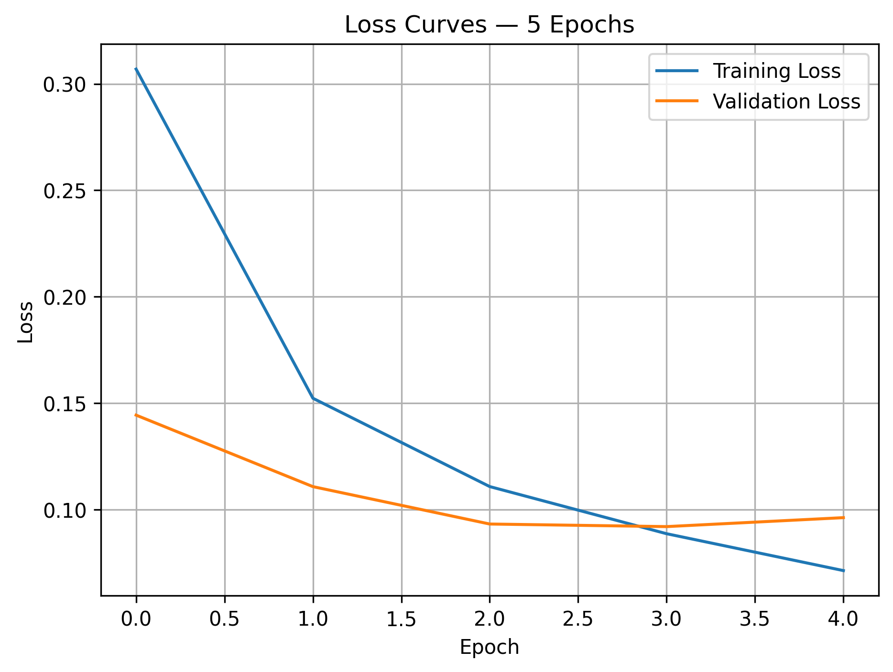
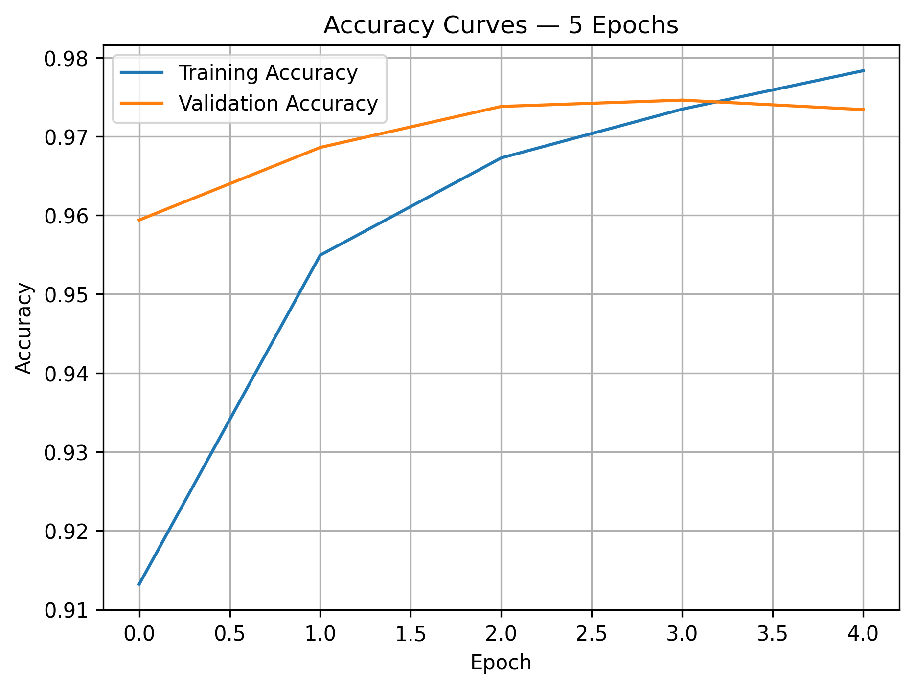
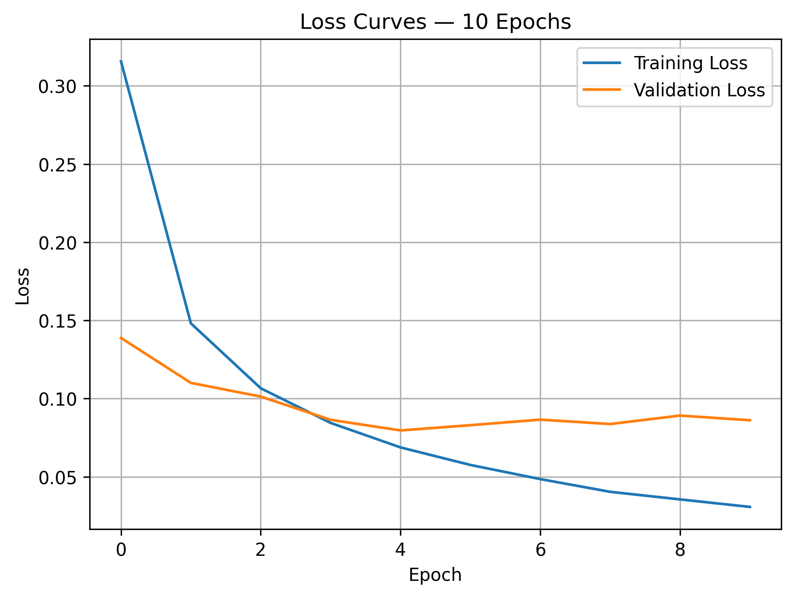
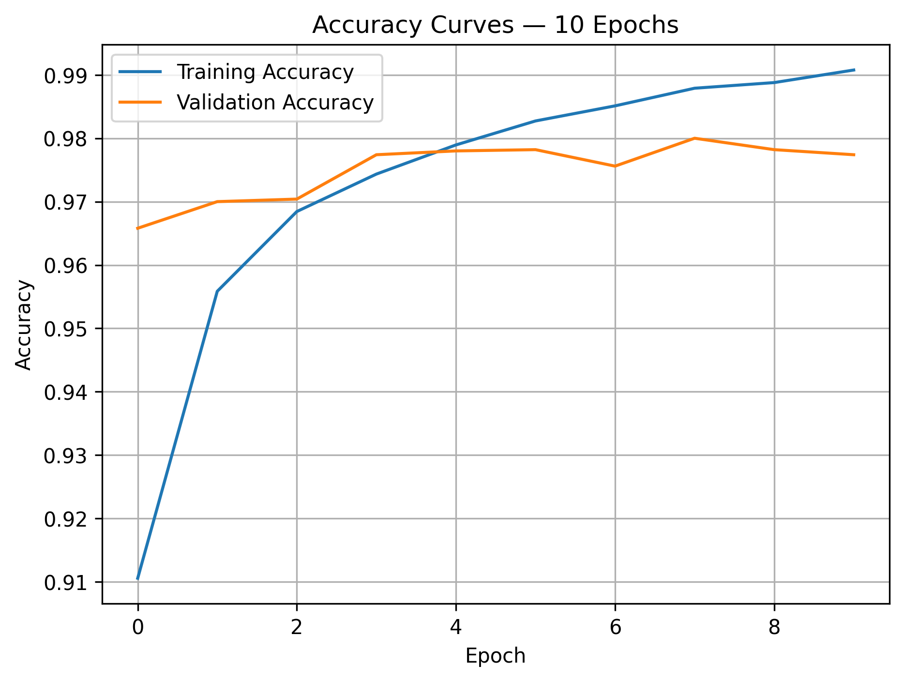
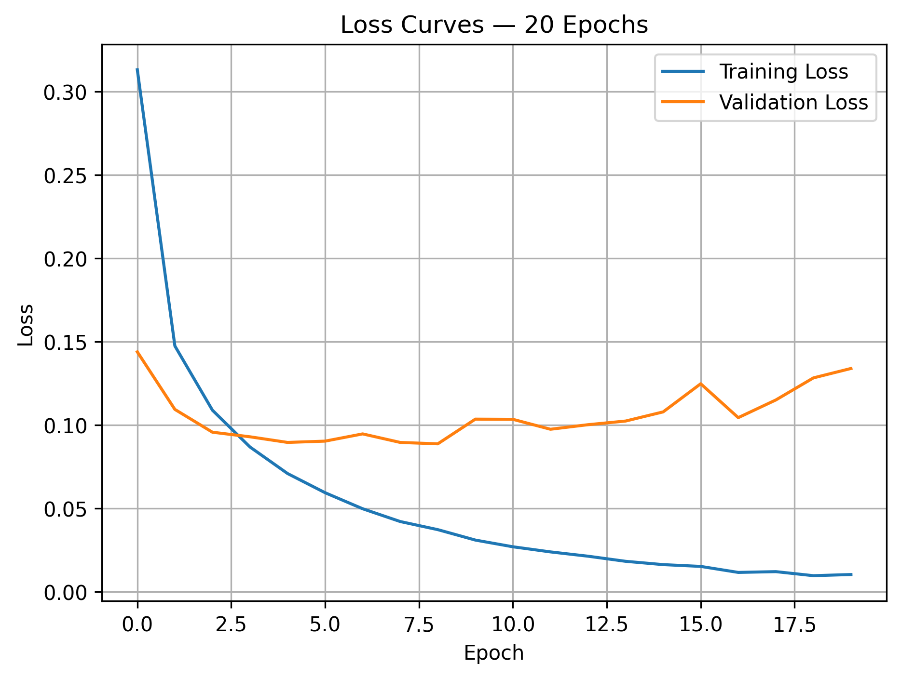
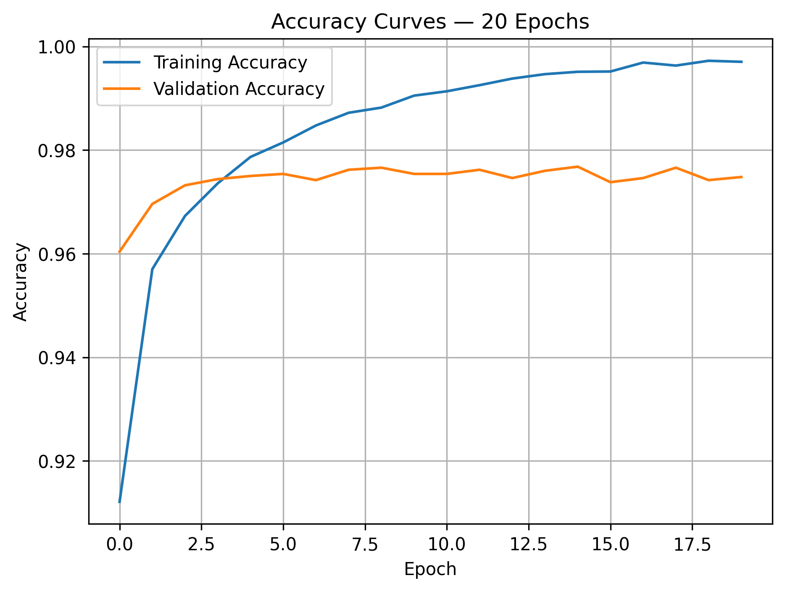

# Task 03 — Epoch-Based Learning Curve Exploration

## 1. Objective

Train the same model three times using 5, 10, and 20 epochs, plot the learning curves for each run, and analyze the training dynamics — identifying overfitting signs and explaining how Adam influenced convergence speed and stability.

---

## 2. Code Used

```python
def create_model(seed=42):
    """
    Create a new model with the same initial weights
    for every epoch experiment.
    """

    # Reset the random generators before creating each model.
    keras.utils.set_random_seed(seed)

    model = keras.Sequential([
        keras.layers.Input(shape=(28, 28)),
        keras.layers.Flatten(),
        keras.layers.Dense(64, activation="relu"),
        keras.layers.Dense(10, activation="softmax")
    ])

    model.compile(
        optimizer=keras.optimizers.Adam(
            learning_rate=0.001
        ),
        loss="sparse_categorical_crossentropy",
        metrics=["accuracy"]
    )

    return model


def plot_learning_curves(history, num_epochs):
    """
    Plot and save the loss and accuracy curves.
    """

    epoch_numbers = range(
        1,
        len(history.history["loss"]) + 1
    )

    # Plot loss curves.
    fig = plt.figure(figsize=(7, 5))

    plt.plot(
        epoch_numbers,
        history.history["loss"],
        label="Training Loss"
    )

    plt.plot(
        epoch_numbers,
        history.history["val_loss"],
        label="Validation Loss"
    )

    plt.title(f"Loss Curves — {num_epochs} Epochs")
    plt.xlabel("Epoch")
    plt.ylabel("Loss")
    plt.xticks(epoch_numbers)
    plt.legend()
    plt.grid()

    fig.savefig(
        task3_results_dir
        / f"task03_{num_epochs}_epochs_loss.png",
        dpi=300,
        bbox_inches="tight"
    )

    plt.show()
    plt.close(fig)

    # Plot accuracy curves.
    fig = plt.figure(figsize=(7, 5))

    plt.plot(
        epoch_numbers,
        history.history["accuracy"],
        label="Training Accuracy"
    )

    plt.plot(
        epoch_numbers,
        history.history["val_accuracy"],
        label="Validation Accuracy"
    )

    plt.title(f"Accuracy Curves — {num_epochs} Epochs")
    plt.xlabel("Epoch")
    plt.ylabel("Accuracy")
    plt.xticks(epoch_numbers)
    plt.legend()
    plt.grid()

    fig.savefig(
        task3_results_dir
        / f"task03_{num_epochs}_epochs_accuracy.png",
        dpi=300,
        bbox_inches="tight"
    )

    plt.show()
    plt.close(fig)


# Store the training histories.
histories = {}

# Train the same architecture for 5, 10, and 20 epochs.
for num_epochs in [5, 10, 20]:

    model = create_model(seed=42)

    history = model.fit(
        x_train,
        y_train,
        epochs=num_epochs,
        batch_size=32,
        validation_data=(x_val, y_val),
        verbose=1
    )

    histories[num_epochs] = history

    plot_learning_curves(
        history,
        num_epochs
    )

```

## 3. Results

| Epochs | Train Loss | Val Loss | Train Accuracy | Val Accuracy | Best Epoch |
|---:|---:|---:|---:|---:|---:|
| 5  | 0.0699 | 0.0991 | 0.9792 | 0.9704 | 4 |
| 10 | 0.0296 | 0.1080 | 0.9922 | 0.9716 | 4 |
| 20 | 0.0081 | 0.1307 | 0.9980 | 0.9746 | 4 |

The training loss decreased continuously as the number of epochs increased. However, the validation loss reached its minimum value of `0.0986` at Epoch 4 in all three experiments.

The loss gap increased from `0.0292` after 5 epochs to `0.0784` after 10 epochs and `0.1226` after 20 epochs.

**How the Best Epoch Was Determined?**

The best epoch was selected based on the lowest validation loss:

```python
best_epoch = np.argmin(history.history["val_loss"]) + 1
best_validation_loss = np.min(history.history["val_loss"])
```

---

## 4. Learning Curves

### 5 Epochs

<table>
  <tr>
    <th>Loss Curves</th>
    <th>Accuracy Curves</th>
  </tr>
  <tr>
    <td>
      
    </td>
    <td>
      
    </td>
  </tr>
</table>

### 10 Epochs

<table>
  <tr>
    <th>Loss Curves</th>
    <th>Accuracy Curves</th>
  </tr>
  <tr>
    <td>
      
    </td>
    <td>
      
    </td>
  </tr>
</table>

### 20 Epochs

<table>
  <tr>
    <th>Loss Curves</th>
    <th>Accuracy Curves</th>
  </tr>
  <tr>
    <td>
      
    </td>
    <td>
      
    </td>
  </tr>
</table>

---

## 5. Training Dynamics Analysis

### 5 Epochs

During the first four epochs, both training and validation loss decreased, showing that the model was learning useful patterns.

At Epoch 5, training loss continued to decrease, while validation loss increased slightly from its best value. This represents the beginning of overfitting, although the gap was still relatively small.

The model was not underfitting because it already achieved:

- Training accuracy: `97.92%`
- Validation accuracy: `97.04%`

### 10 Epochs

Training loss continued to decrease until it reached `0.0296`, while validation loss increased to `0.1080`.

Training accuracy increased to `99.22%`, but validation accuracy remained around `97.16%`. The widening difference between training and validation performance shows that the model increasingly fitted training-specific patterns.

Therefore, overfitting became clearer after Epoch 4.

### 20 Epochs

The 20-epoch experiment showed the strongest overfitting.

Training loss decreased to `0.0081`, and training accuracy reached `99.80%`. In contrast, validation loss increased to `0.1307`.

Although validation accuracy increased slightly to `97.46%`, the validation loss became considerably worse. This can occur when the model makes a small number of incorrect predictions with very high confidence, which heavily increases the Cross-Entropy loss.

The model continued improving on the training data without achieving a similar improvement on unseen validation data.

---

## 5. Overfitting Signs

The main signs of overfitting were:

- Training loss continued decreasing.
- Validation loss stopped improving after Epoch 4.
- The gap between training and validation loss increased.
- Training accuracy approached `100%`.
- Validation accuracy improved only slightly.

The best generalization point was around Epoch 4, where the validation loss was lowest.

---

## 6. Adam Optimizer Influence

Adam produced rapid convergence during the first few epochs.

The training loss dropped sharply, while training accuracy increased from approximately `91%` after the first epoch to more than `97%` within only a few epochs.

Adam adjusts the update size separately for each model parameter using the recent gradient history. This helped produce:

- Fast improvement during early training.
- A smooth decrease in training loss.
- Stable training without large oscillations.

However, Adam did not prevent overfitting. Once validation performance stopped improving, it continued optimizing the model for the training data.

---

## 7. Key Takeaway

Increasing the number of epochs improved training performance but did not continuously improve validation performance.

The lowest validation loss occurred at Epoch 4. Training beyond this point caused the model to fit the training data more strongly while validation loss increased.

Therefore, more epochs do not necessarily produce better generalization, and techniques such as Early Stopping can be used to stop training near the best validation epoch.
