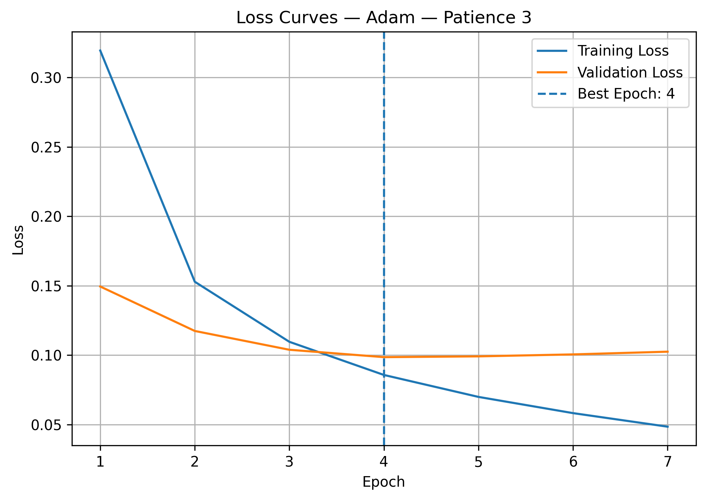
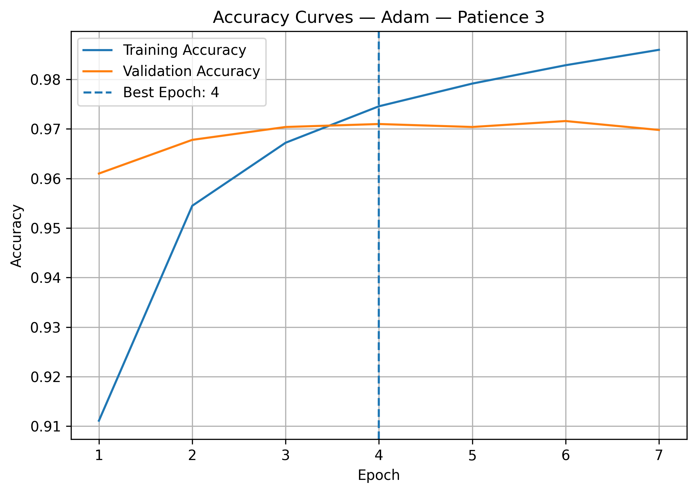
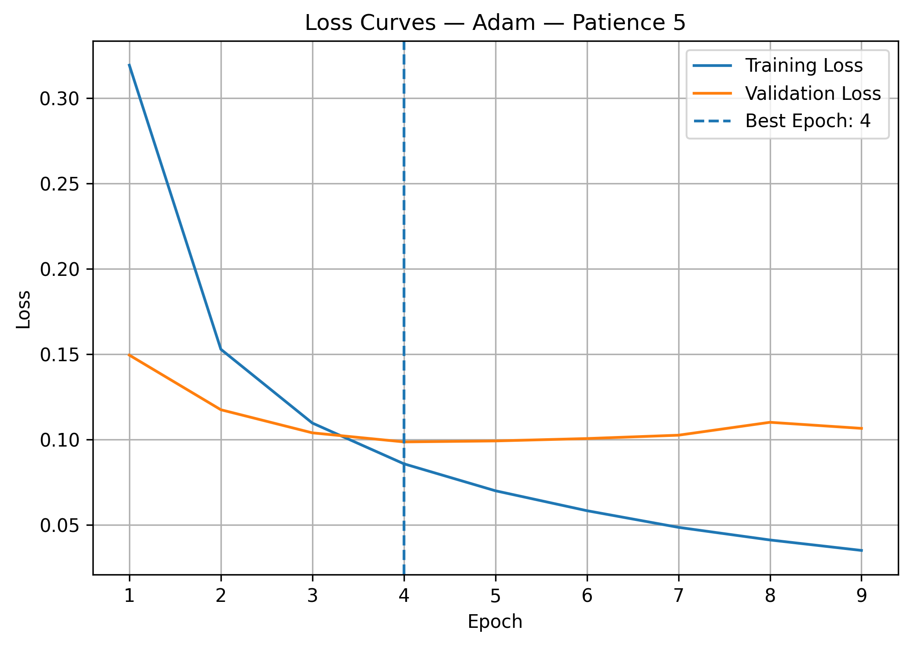
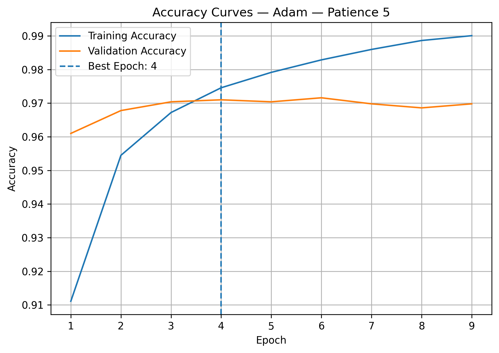
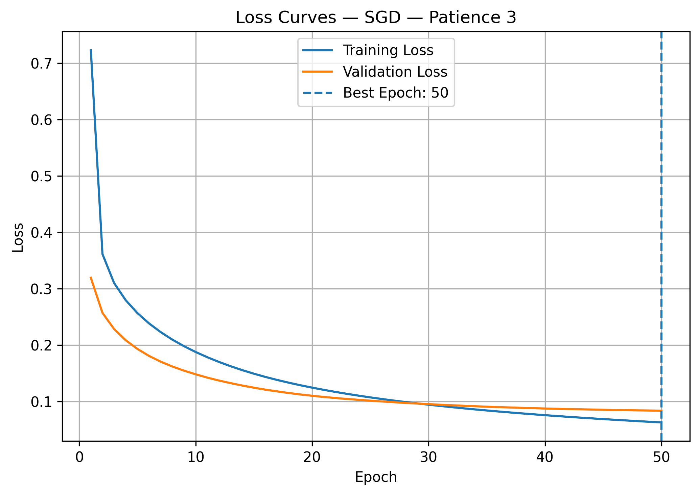
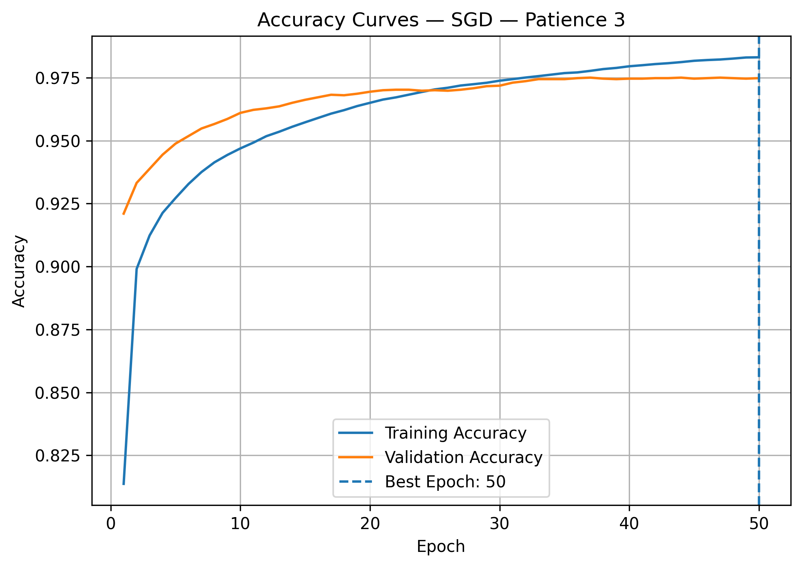

# Task 04 — EarlyStopping Behavior Analysis

## 1. Objective

The objective of this task is to examine how the `EarlyStopping` callback controls the training duration based on validation performance. The experiment compares `patience=3` and `patience=5`, and also investigates whether changing the optimizer from Adam to SGD affects the stopping pattern.

## 2. Code Used

```python
def create_model(optimizer_name, seed=42):
    """
    Create the same model architecture for each experiment.
    """
    # Use the same initial weights for a fair comparison.
    keras.utils.set_random_seed(seed)

    model = keras.Sequential([
        keras.layers.Input(shape=(28, 28)),
        keras.layers.Flatten(),
        keras.layers.Dense(64, activation="relu"),
        keras.layers.Dense(10, activation="softmax")
    ])

    if optimizer_name == "adam":
        optimizer = keras.optimizers.Adam(learning_rate=0.001)
    elif optimizer_name == "sgd":
        optimizer = keras.optimizers.SGD(learning_rate=0.01)
    else:
        raise ValueError("optimizer_name must be 'adam' or 'sgd'.")

    model.compile(
        optimizer=optimizer,
        loss="sparse_categorical_crossentropy",
        metrics=["accuracy"]
    )
    return model


def plot_learning_curves(history, experiment_name, experiment_title, best_epoch):
    """
    Plot and save loss and accuracy curves.
    """
    epoch_numbers = range(1, len(history.history["loss"]) + 1)

    for metric in ["loss", "accuracy"]:
        fig = plt.figure(figsize=(7, 5))
        plt.plot(epoch_numbers, history.history[metric],           label=f"Training {metric.capitalize()}")
        plt.plot(epoch_numbers, history.history[f"val_{metric}"],  label=f"Validation {metric.capitalize()}")
        plt.axvline(best_epoch, linestyle="--",                    label=f"Best Epoch: {best_epoch}")
        plt.title(f"{metric.capitalize()} Curves — {experiment_title}")
        plt.xlabel("Epoch")
        plt.ylabel(metric.capitalize())
        plt.legend()
        plt.grid()
        plt.tight_layout()
        fig.savefig(
            task4_results_dir / f"task04_{experiment_name}_{metric}.png",
            dpi=300,
            bbox_inches="tight"
        )
        plt.show()
        plt.close(fig)


# Define the EarlyStopping experiments.
experiments = [
    {"name": "adam_patience_3", "title": "Adam — Patience 3", "optimizer": "adam", "patience": 3, "max_epochs": 30},
    {"name": "adam_patience_5", "title": "Adam — Patience 5", "optimizer": "adam", "patience": 5, "max_epochs": 30},
    {"name": "sgd_patience_3",  "title": "SGD — Patience 3",  "optimizer": "sgd",  "patience": 3, "max_epochs": 50}
]

# Store the results of all experiments.
experiment_results = []

for experiment in experiments:

    # Create a new model for each experiment.
    model = create_model(optimizer_name=experiment["optimizer"], seed=42)

    # Create the EarlyStopping callback.
    early_stopping = keras.callbacks.EarlyStopping(
        monitor="val_loss",
        patience=experiment["patience"],
        restore_best_weights=True,
        verbose=1
    )

    # Train the model.
    history = model.fit(
        x_train, y_train,
        epochs=experiment["max_epochs"],
        batch_size=32,
        validation_data=(x_val, y_val),
        callbacks=[early_stopping],
        verbose=1
    )

    # Find the actual number of completed epochs.
    stopped_epoch = len(history.history["loss"])

    # Find the epoch with the lowest validation loss.
    best_epoch          = np.argmin(history.history["val_loss"]) + 1
    best_validation_loss = np.min(history.history["val_loss"])

    final_training_loss      = history.history["loss"][-1]
    final_validation_loss    = history.history["val_loss"][-1]
    final_training_accuracy  = history.history["accuracy"][-1]
    final_validation_accuracy = history.history["val_accuracy"][-1]

    # Check whether EarlyStopping stopped the training.
    early_stopping_triggered = stopped_epoch < experiment["max_epochs"]

    print(f"\n{experiment['title']}")
    print(f"Best epoch: {best_epoch} | Stopped epoch: {stopped_epoch}")
    print(f"Best validation loss: {best_validation_loss:.4f}")
    print(f"EarlyStopping triggered: {early_stopping_triggered}")

    # Save the learning curves.
    plot_learning_curves(
        history=history,
        experiment_name=experiment["name"],
        experiment_title=experiment["title"],
        best_epoch=best_epoch
    )

    # Store the experiment results.
    experiment_results.append({
        "title":                    experiment["title"],
        "optimizer":                experiment["optimizer"],
        "patience":                 experiment["patience"],
        "max_epochs":               experiment["max_epochs"],
        "stopped_epoch":            stopped_epoch,
        "best_epoch":               best_epoch,
        "best_validation_loss":     best_validation_loss,
        "final_training_loss":      final_training_loss,
        "final_validation_loss":    final_validation_loss,
        "final_training_accuracy":  final_training_accuracy,
        "final_validation_accuracy":final_validation_accuracy,
        "early_stopping_triggered": early_stopping_triggered
    })
```

## 3. Results

| Experiment | Optimizer | Patience | Maximum Epochs | Best Epoch | Training Ended At | Best Validation Loss | EarlyStopping Triggered |
|---|---|---:|---:|---:|---:|---:|---|
| 1 | Adam | 3 | 30 | 4 | 7 | 0.0986 | Yes |
| 2 | Adam | 5 | 30 | 4 | 9 | 0.0986 | Yes |
| 3 | SGD | 3 | 50 | 50 | 50 | 0.0836 | No |

`Training Ended At` represents the number of completed epochs.

For the SGD experiment, training ended because it reached the maximum limit of `50 epochs`, not because `EarlyStopping` was triggered.

Validation loss was used because it measures performance on unseen validation data and can reveal overfitting when training loss continues decreasing.

---

## 4. Learning Curves

### Experiment 1 — Adam with Patience = 3

<table>
  <tr>
    <th>Loss Curves</th>
    <th>Accuracy Curves</th>
  </tr>
  <tr>
    <td>
      
    </td>
    <td>
      
    </td>
  </tr>
</table>

### Experiment 2 — Adam with Patience = 5

<table>
  <tr>
    <th>Loss Curves</th>
    <th>Accuracy Curves</th>
  </tr>
  <tr>
    <td>
      
    </td>
    <td>
      
    </td>
  </tr>
</table>

### Experiment 3 — SGD with Patience = 3

<table>
  <tr>
    <th>Loss Curves</th>
    <th>Accuracy Curves</th>
  </tr>
  <tr>
    <td>
      
    </td>
    <td>
      
    </td>
  </tr>
</table>

---
## 5. EarlyStopping Behavior Analysis

### Adam with Patience = 3

The lowest validation loss was `0.0986` at Epoch `4`. After that, validation loss did not improve for three consecutive epochs:

```text
Epochs without improvement: 5, 6, and 7
```
Therefore, EarlyStopping stopped training at Epoch 7, and because `restore_best_weights=True`, the model restored the weights from Epoch 4, where validation loss was lowest.

### Adam with Patience = 5

The lowest validation loss was also 0.0986 at Epoch 4. With patience=5, training continued through five non-improving epochs:
```text
Epochs without improvement: 5, 6, 7, 8, and 9
```
Training therefore stopped at Epoch 9. 

Increasing patience delayed stopping by two epochs, but it did not improve the best validation loss. Training loss continued decreasing while validation loss increased, indicating stronger fitting to the training data without better generalization.

### Effect of Using SGD

SGD behaved differently from Adam because it used a fixed learning rate and updated weights directly from the current gradients. This produced slower and more gradual convergence.

Its validation loss continued decreasing until Epoch 50, where it reached its lowest value of 0.0836.

Because the best result occurred at the final allowed epoch, the required three non-improving epochs were never reached:
```text
EarlyStopping Triggered: False
```
The actual EarlyStopping epoch for SGD cannot be determined because training ended at the maximum limit of 50 epochs.

In this experiment, Adam reached its best result quickly at Epoch 4, while SGD required many more epochs but achieved a lower validation loss:

Adam Best Validation Loss: `0.0986`
SGD Best Validation Loss:  `0.0836`

---

## 6. How the Optimizer Affected EarlyStopping

EarlyStopping does not directly depend on the optimizer. It only monitors the selected metric, which was `val_loss`. However, the optimizer indirectly affects when EarlyStopping activates because it determines how the model weights are updated.

### Adam

Adam produced rapid improvement during the first few epochs.The validation loss reached its minimum at Epoch 4 and then stopped improving. This caused EarlyStopping to activate early.

### SGD

SGD produced slower and more gradual changes. The validation loss continued decreasing until the final epoch, so the required sequence of non-improving epochs never occurred. This demonstrates that different optimizers can produce different stopping patterns even when EarlyStopping uses the same monitor and patience value.

---

## 7. EarlyStopping as Indirect Regularization

EarlyStopping acts as an indirect form of regularization by limiting the number of weight updates performed during training.

When training continues for too long, the model may begin learning noise or details that are specific to the training set. Stopping near the best validation epoch helps prevent this excessive fitting and preserves better generalization.

Unlike L2 regularization, EarlyStopping does not add a penalty to the loss function. Unlike Dropout, it does not change the network architecture. Instead, it controls how long the model is allowed to train.

---

## 8. Key Takeaway

EarlyStopping successfully stopped both Adam experiments after validation loss stopped improving.

Increasing patience from `3` to `5` delayed stopping from Epoch `7` to Epoch `9`, but both experiments restored the same best weights from Epoch `4`.

Adam reached its best validation result quickly, while SGD improved more gradually and did not trigger EarlyStopping within the `50-epoch` limit.

The experiment shows that patience controls how long the model waits, while the optimizer influences the validation-loss behavior that EarlyStopping monitors.
