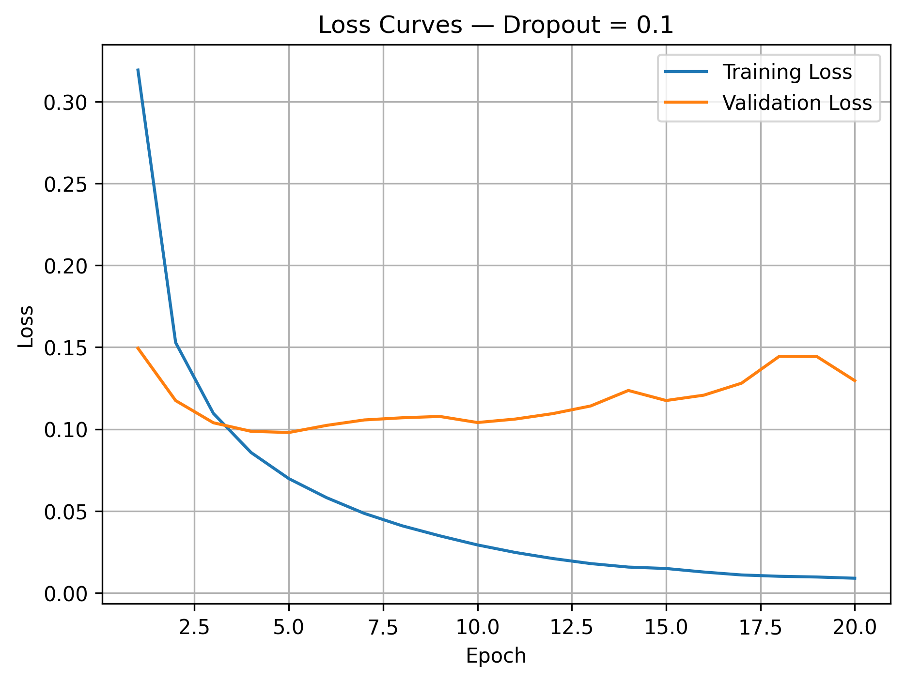
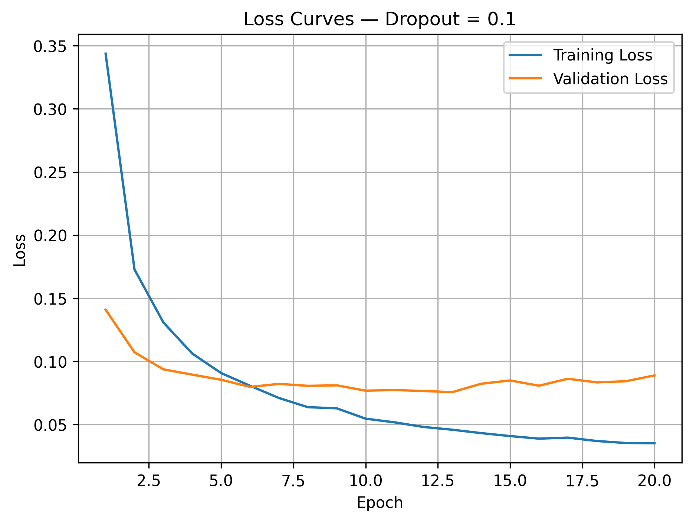
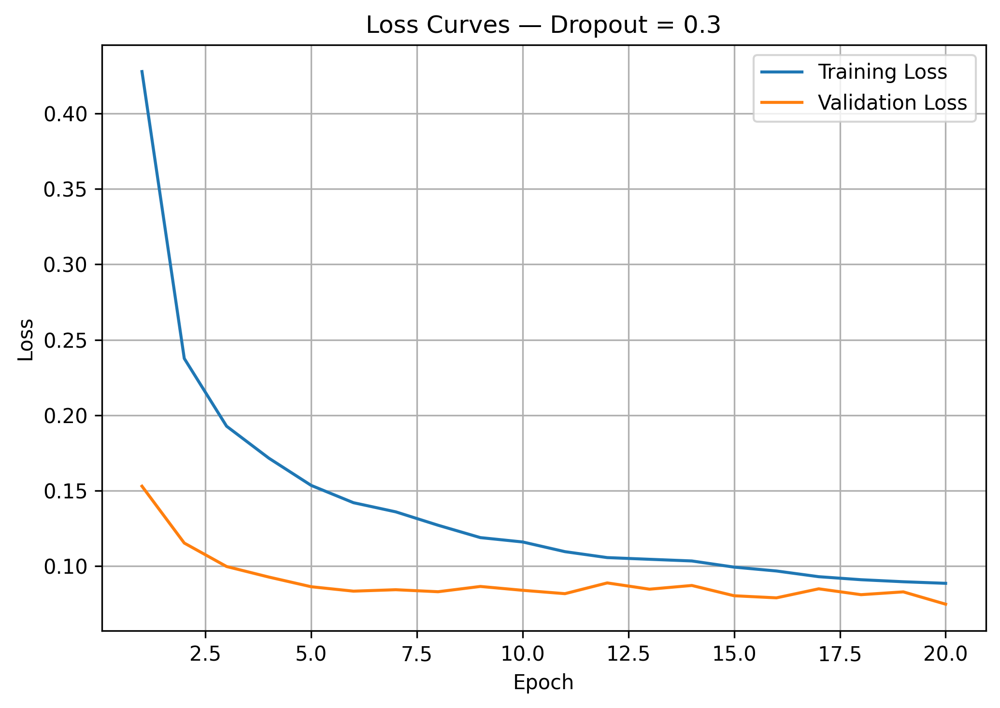

Paste the following into:

```text
submission/Task05_Dropout.md
```

# Task 05 — Dropout Ablation Study

## 1. Objective

The objective of this task is to study how different Dropout rates affect overfitting and generalization. Three independent models were trained using the same architecture and settings:

* No Dropout
* Dropout = `0.1`
* Dropout = `0.3`

The training and validation losses were compared to determine how Dropout influences the model’s learned representations.

## 2. Code Used

```python
# Define the Dropout configurations.
dropout_rates = [0.0, 0.1, 0.3]
dropout_histories = {}

for dropout_rate in dropout_rates:

    # Create a new model for each experiment.
    dropout_model = create_dropout_model(
        dropout_rate=dropout_rate,
        seed=42
    )

    # Train every model using the same settings.
    history = dropout_model.fit(
        x_train,
        y_train,
        epochs=20,
        batch_size=32,
        validation_data=(x_val, y_val),
        verbose=1
    )

    # Store the training history.
    dropout_histories[dropout_rate] = history

    # Plot and save training loss versus validation loss.
    plot_dropout_loss(
        history,
        dropout_rate
    )
```

## 3. Results

| Configuration | Final Train Loss | Final Val Loss | Train Accuracy | Val Accuracy | Best Val Loss | Best Epoch |
| ------------- | ---------------: | -------------: | -------------: | -----------: | ------------: | ---------: |
| No Dropout    |           0.0089 |         0.1296 |         0.9973 |       0.9736 |        0.0979 |          5 |
| Dropout = 0.1 |           0.0344 |         0.1007 |         0.9879 |       0.9750 |        0.0858 |          8 |
| Dropout = 0.3 |           0.0888 |         0.0944 |         0.9709 |       0.9746 |        0.0853 |         12 |

### No Dropout



### Dropout = 0.1



### Dropout = 0.3



## 4. Short Analysis

### No Dropout

The model without Dropout achieved the highest training accuracy of `99.73%` and the lowest training loss of `0.0089`. However, its validation loss increased to `0.1296`, while validation accuracy remained lower at `97.36%`.

The model achieved its best validation loss at epoch `5`, but continued improving only on the training data afterward. This large separation between training and validation performance indicates clear overfitting.

### Dropout = 0.1

Using a Dropout rate of `0.1` reduced overfitting while preserving strong training performance. The final validation loss decreased to `0.1007`, and the model achieved the highest final validation accuracy of `97.50%`.

Its best validation loss was `0.0858` at epoch `8`. This configuration provided a good balance between fitting the training data and generalizing to unseen validation data.

### Dropout = 0.3

A Dropout rate of `0.3` applied stronger regularization. Its training loss increased to `0.0888`, and training accuracy decreased to `97.09%`, because 30% of the hidden neurons were randomly disabled during each training step.

Despite the lower training performance, the model maintained a validation accuracy of `97.46%` and achieved the lowest best validation loss, `0.0853`, at epoch `12`. This shows that stronger Dropout significantly limited overfitting while maintaining good generalization.

The validation accuracy was slightly higher than the training accuracy because Dropout was active during training but disabled during validation. During validation, the complete network was available for prediction.

### Comparison of Overfitting

| Configuration | Observed Overfitting |
| ------------- | -------------------- |
| No Dropout    | High                 |
| Dropout = 0.1 | Reduced              |
| Dropout = 0.3 | Lowest               |

The model without Dropout fitted the training data extremely closely, but its validation performance became worse. Both Dropout configurations reduced this gap, with `0.3` providing the strongest regularization.

However, training and validation losses under Dropout are not perfectly comparable because Dropout is active only while calculating the training metrics. Validation uses the complete network without randomly disabled neurons.

### How Dropout Prevents Neuron Co-adaptation

Without Dropout, some neurons may become dependent on specific other neurons. They learn to work together as one fixed combination rather than learning useful features independently. This behavior is called **neuron co-adaptation**.

During training, Dropout randomly disables a fraction of the hidden neurons:

```text
Dropout = 0.1 → approximately 10% disabled
Dropout = 0.3 → approximately 30% disabled
```

Because a neuron cannot depend on the same neighboring neurons in every training step, it must learn features that remain useful under different network configurations.

This encourages the network to learn more independent and robust representations. As a result, the model becomes less dependent on specific training patterns and generalizes better to unseen data.

## 5. Key Takeaway

Dropout reduced overfitting by preventing neurons from relying on fixed combinations of other neurons. A Dropout rate of `0.1` achieved the highest final validation accuracy, while `0.3` provided the strongest regularization and the lowest best validation loss.


-----------------------------------------------
### 4. Short Analysis

#### No Dropout

The model without Dropout achieved the highest training accuracy, `99.73%`, and the lowest training loss, `0.0089`. However, its validation loss increased to `0.1296`, producing the largest loss gap of `0.1207`.

This indicates strong overfitting. The model continued fitting the training data after reaching its best validation loss at epoch `5`, but its ability to generalize did not improve.

#### Dropout = 0.1

Using a Dropout rate of `0.1` reduced overfitting. The final validation loss decreased to `0.1007`, while the loss gap dropped to `0.0663`.

The model achieved the highest final validation accuracy, `97.50%`, and reached its best validation loss of `0.0858` at epoch `8`. This configuration provided a good balance between training performance and generalization.

#### Dropout = 0.3

A Dropout rate of `0.3` produced the smallest loss gap, only `0.0055`, indicating the strongest reduction in overfitting.

The training loss was higher at `0.0888`, and training accuracy decreased to `97.09%`, because 30% of the hidden neurons were randomly disabled during training. However, validation accuracy remained strong at `97.46%`, and this configuration achieved the lowest best validation loss, `0.0853`, at epoch `12`.

The validation accuracy was slightly higher than the training accuracy because Dropout is active during training but disabled during validation. Therefore, the full network is used when evaluating the validation data.

### Comparison of Overfitting

| Configuration | Final Loss Gap | Overfitting Level |
| ------------- | -------------: | ----------------- |
| No Dropout    |         0.1207 | High              |
| Dropout = 0.1 |         0.0663 | Moderate          |
| Dropout = 0.3 |         0.0055 | Very low          |

### How Dropout Encourages Robust Representations

Without Dropout, neurons can become highly dependent on specific other neurons. This is known as neuron co-adaptation.

Dropout randomly disables some neurons during each training step, preventing the network from relying on one fixed combination of features. As a result, neurons must learn features that remain useful even when other neurons are unavailable.

This encourages more independent and robust internal representations, improves generalization, and reduces overfitting.

### 5. Key Takeaway

Dropout reduced overfitting by preventing neuron co-adaptation. A rate of `0.1` achieved the highest final validation accuracy, while `0.3` produced the smallest loss gap and the lowest best validation loss.
