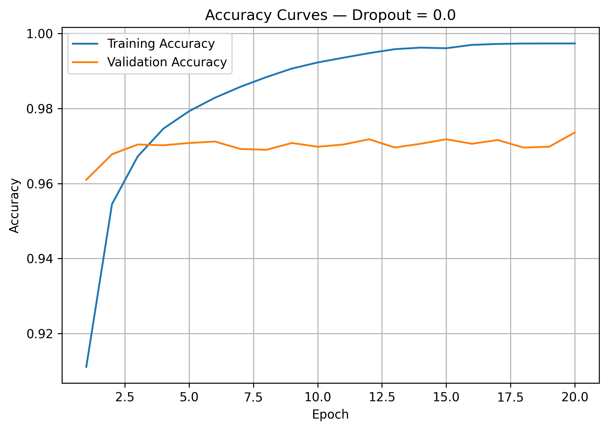
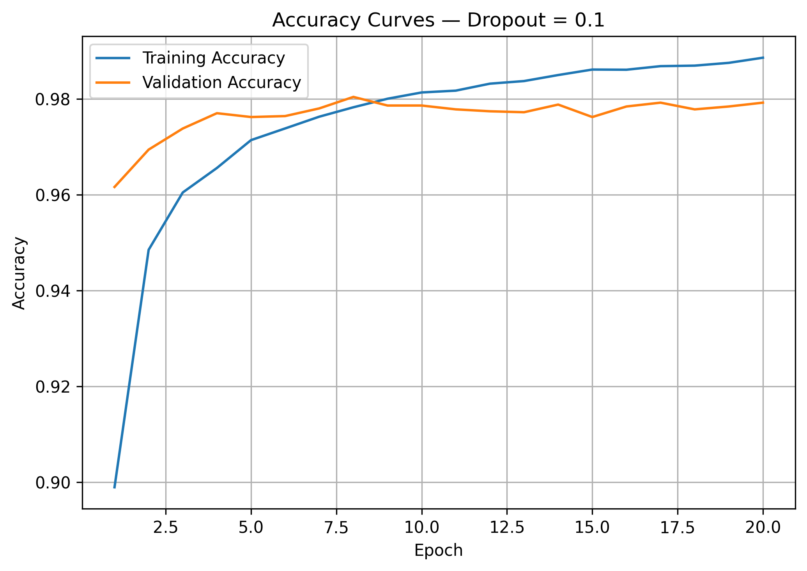
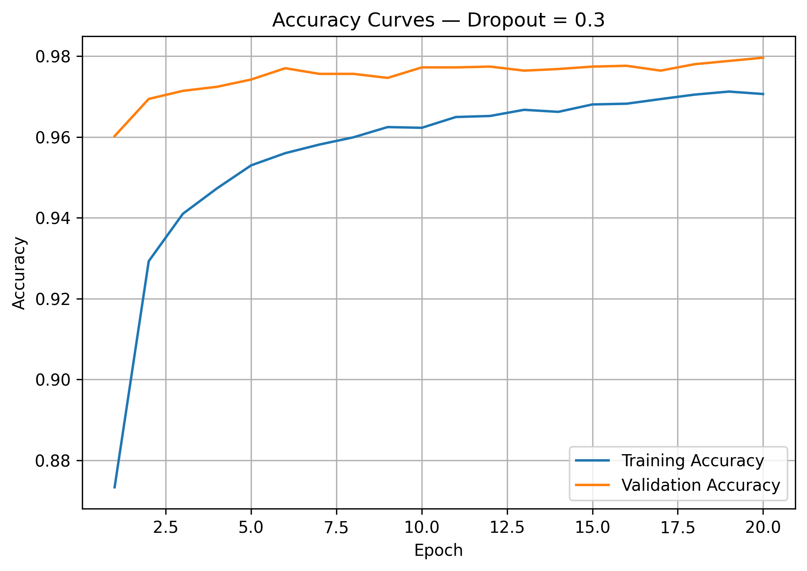

# Task 05 — Dropout Ablation Study

## 1. Objective

The objective of this task is to study how different Dropout rates affect overfitting and generalization. Three independent models were trained using the same architecture and settings:

* No Dropout
* Dropout = `0.1`
* Dropout = `0.3`

The training and validation losses were compared to determine how Dropout influences the model’s learned representations.

## 2. Code Used

```python
# Create a directory for Task 05 results.
task5_results_dir = Path("results/loss_curves/task05_dropout")
task5_results_dir.mkdir(parents=True, exist_ok=True)

# Create a new model for each Dropout experiment.
def create_dropout_model(dropout_rate, seed=42):
    # Use the same initial weights for a fair comparison.
    keras.utils.set_random_seed(seed)

    model = keras.Sequential([
        # Define the expected input shape.
        keras.layers.Input(shape=(28, 28)),
        # Convert each image into 784 pixel values.
        keras.layers.Flatten(),
        # Hidden layer that learns non-linear patterns.
        keras.layers.Dense(64, activation="relu"),
        # Randomly disable neurons during training.
        keras.layers.Dropout(dropout_rate, seed=seed),
        # Output one probability for each digit.
        keras.layers.Dense(10, activation="softmax")
    ])

    # Configure the model for training.
    model.compile(
        optimizer=keras.optimizers.Adam(learning_rate=0.001),
        loss="sparse_categorical_crossentropy",
        metrics=["accuracy"]
    )
    return model

# Plot and save loss and accuracy curves.
def plot_dropout_curves(history, dropout_rate):
    rate_name = str(dropout_rate).replace(".", "_")
    epochs = range(1, len(history.history["loss"]) + 1)

    # Plot training loss and validation loss.
    plt.figure(figsize=(7, 5))
    plt.plot(epochs, history.history["loss"], label="Training Loss")
    plt.plot(epochs, history.history["val_loss"], label="Validation Loss")
    plt.title(f"Loss Curves — Dropout = {dropout_rate}")
    plt.xlabel("Epoch")
    plt.ylabel("Loss")
    plt.legend()
    plt.grid()
    plt.tight_layout()
    plt.savefig(
        task5_results_dir / f"task05_dropout_{rate_name}_loss.png",
        dpi=300,
        bbox_inches="tight"
    )
    plt.show()
    plt.close()

    # Plot training accuracy and validation accuracy.
    plt.figure(figsize=(7, 5))
    plt.plot(epochs, history.history["accuracy"], label="Training Accuracy")
    plt.plot(epochs, history.history["val_accuracy"], label="Validation Accuracy")
    plt.title(f"Accuracy Curves — Dropout = {dropout_rate}")
    plt.xlabel("Epoch")
    plt.ylabel("Accuracy")
    plt.legend()
    plt.grid()
    plt.tight_layout()
    plt.savefig(
        task5_results_dir / f"task05_dropout_{rate_name}_accuracy.png",
        dpi=300,
        bbox_inches="tight"
    )
    plt.show()
    plt.close()

# Define the Dropout configurations.
dropout_rates = [0.0, 0.1, 0.3]

# Store the histories and results.
dropout_histories = {}
dropout_results = []

for dropout_rate in dropout_rates:
    # Create a fresh model for each experiment.
    dropout_model = create_dropout_model(dropout_rate, seed=42)

    # Train every model using the same settings.
    history = dropout_model.fit(
        x_train,
        y_train,
        epochs=20,
        batch_size=32,
        validation_data=(x_val, y_val),
        verbose=1
    )

    # Store the training history.
    dropout_histories[dropout_rate] = history

    # Get the final metrics.
    final_train_loss = history.history["loss"][-1]
    final_val_loss = history.history["val_loss"][-1]
    final_train_accuracy = history.history["accuracy"][-1]
    final_val_accuracy = history.history["val_accuracy"][-1]

    # Calculate the training-validation gaps.
    loss_gap = final_val_loss - final_train_loss
    accuracy_gap = final_train_accuracy - final_val_accuracy

    # Find the lowest validation loss and its epoch.
    best_val_loss = np.min(history.history["val_loss"])
    best_epoch = np.argmin(history.history["val_loss"]) + 1

    print(f"\nDropout Rate: {dropout_rate}")
    print(f"Final Training Loss: {final_train_loss:.4f}")
    print(f"Final Validation Loss: {final_val_loss:.4f}")
    print(f"Final Training Accuracy: {final_train_accuracy:.4f}")
    print(f"Final Validation Accuracy: {final_val_accuracy:.4f}")
    print(f"Loss Gap: {loss_gap:.4f}")
    print(f"Accuracy Gap: {accuracy_gap:.4f}")
    print(f"Best Validation Loss: {best_val_loss:.4f}")
    print(f"Best Epoch: {best_epoch}")

    # Plot and save loss and accuracy curves.
    plot_dropout_curves(history, dropout_rate)
```

## 3. Results

| Configuration | Final Train Loss | Final Val Loss | Loss Gap | Train Accuracy | Val Accuracy | Best Val Loss | Best Epoch |
|---|---:|---:|---:|---:|---:|---:|---:|
| No Dropout | 0.0089 | 0.1296 | 0.1207 | 0.9973 | 0.9736 | 0.0979 | 5 |
| Dropout = 0.1 | 0.0337 | 0.0949 | 0.0613 | 0.9886 | 0.9792 | 0.0750 | 7 |
| Dropout = 0.3 | 0.0886 | 0.0748 | -0.0138 | 0.9706 | 0.9796 | 0.0748 | 20 |

---

## 4. Learning Curves

### No Dropout

<table>
  <tr>
    <th>Loss Curves</th>
    <th>Accuracy Curves</th>
  </tr>
  <tr>
    <td>
      
    </td>
    <td>
      
    </td>
  </tr>
</table>

---

### Dropout = 0.1

<table>
  <tr>
    <th>Loss Curves</th>
    <th>Accuracy Curves</th>
  </tr>
  <tr>
    <td>
      
    </td>
    <td>
      
    </td>
  </tr>
</table>

---

### Dropout = 0.3

<table>
  <tr>
    <th>Loss Curves</th>
    <th>Accuracy Curves</th>
  </tr>
  <tr>
    <td>
      
    </td>
    <td>
      
    </td>
  </tr>
</table>

---

## 5. Short Analysis

### No Dropout — Clear Overfitting

Without Dropout, the model fitted the training data very strongly.

The final training loss dropped to `0.0089`, while validation loss increased to `0.1296`. This produced the largest loss gap: `0.1207`.

The best validation loss occurred early at Epoch `5`. After that point, training loss continued decreasing, but validation loss became worse. This is a clear sign of overfitting.

---

### Dropout = 0.1 — Reduced Overfitting

With `Dropout = 0.1`, the final training loss increased to `0.0337`, but the final validation loss decreased to `0.0949`.

The loss gap became smaller:

```text
No Dropout Loss Gap: 0.1207
Dropout 0.1 Loss Gap: 0.0613
```

This shows that Dropout reduced the model's tendency to memorize the training data.

The best validation loss also improved from `0.0979` to `0.0750`.

---

### Dropout = 0.3 — Strongest Regularization

With `Dropout = 0.3`, the model had the highest final training loss: `0.0886`.

This is expected because Dropout randomly disables neurons during training, making the training task harder.

However, it achieved the best validation results:

```text
Best Validation Loss: 0.0748
Validation Accuracy:   0.9796
```

The validation loss was even lower than the training loss. This can happen because Dropout is active during training but inactive during validation. During validation, the full network is used without randomly disabled neurons.

This configuration provided the strongest regularization among the tested rates.

---

### Comparison of Overfitting

| Configuration | Overfitting Level |
|---|---|
| No Dropout | High |
| Dropout = 0.1 | Reduced |
| Dropout = 0.3 | Lowest |

Dropout reduced overfitting by preventing neurons from depending too heavily on fixed combinations of other neurons.

As the Dropout rate increased, the model became less fitted to the training data and more stable on the validation set.

---

## 6. How Dropout Prevents Neuron Co-adaptation

During training, Dropout randomly sets a fraction of neuron outputs to zero. This forces the network to learn useful representations without relying on the same fixed group of neurons every time. As a result, neurons become less dependent on each other, and the model becomes less likely to memorize training-specific patterns.

This explains why the Dropout models had better validation performance than the model without Dropout.

---

## 7. Key Takeaway

Dropout improved generalization by reducing overfitting.

The model without Dropout achieved the lowest training loss, but it had the worst validation loss.

`Dropout = 0.1` reduced overfitting and improved validation performance.

`Dropout = 0.3` provided the strongest regularization and achieved the best validation loss and validation accuracy in this experiment.
