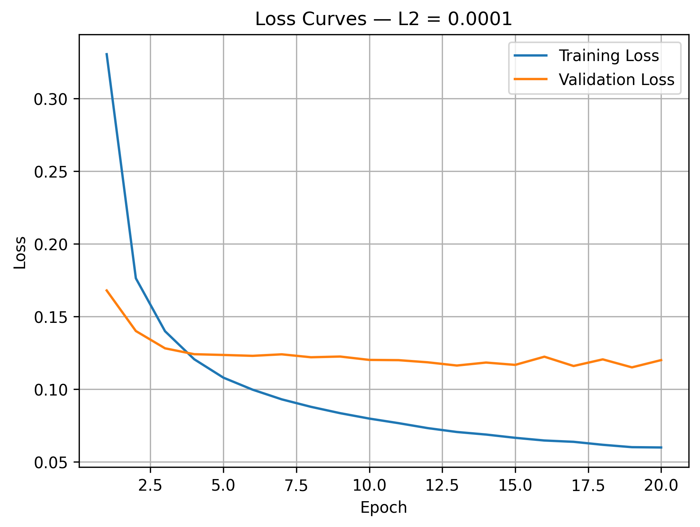
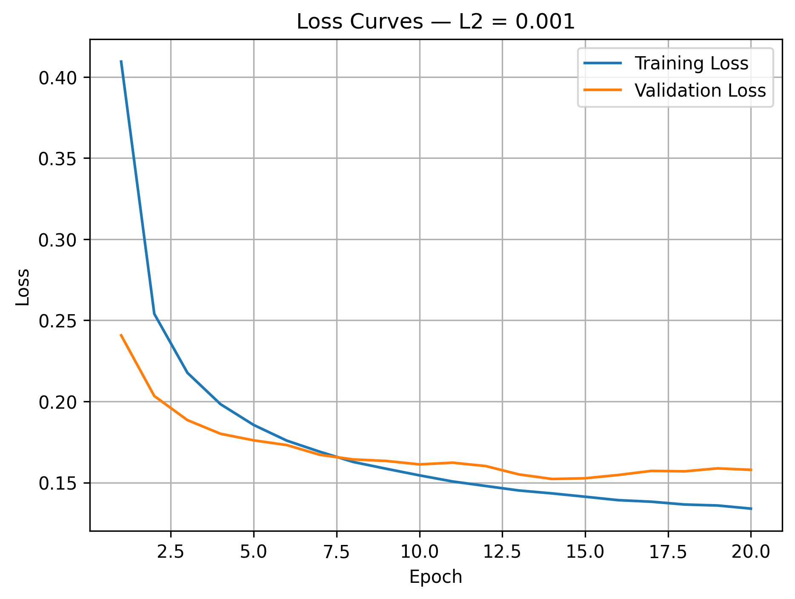
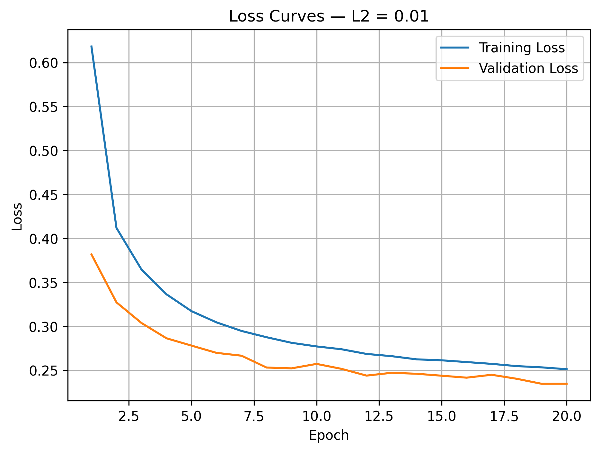

# Task 06 — L2 Regularization Experiment (Self-study)

## 1. Objective
Train the model with three L2 regularization strengths — 0.0001, 0.001, and 0.01 — analyze how the penalty shrinks weight magnitude, why smaller weights improve generalization, and how L2 changes the validation loss trend.

## 2. Code Used
```python
# Create a directory for Task 6 results.
task6_results_dir = Path("results/loss_curves/task06_l2")
task6_results_dir.mkdir(parents=True, exist_ok=True)


def create_l2_model(l2_value, seed=42):

    # Use the same seed so that all experiments start
    # with the same initial weights.
    keras.utils.set_random_seed(seed)

    model = keras.Sequential([
        # Define the input shape of an MNIST image.
        keras.layers.Input(shape=(28, 28)),

        # Convert the 28×28 image into 784 pixel values.
        keras.layers.Flatten(),

        # Apply L2 regularization to the hidden-layer weights.
        keras.layers.Dense(
            64, activation="relu",
            kernel_regularizer=keras.regularizers.l2(l2_value),
            name="hidden_dense"
        ),

        # Output probabilities for digits from 0 to 9.
        keras.layers.Dense(10, activation="softmax", name="output_dense")
    ])

    # Use the same optimizer and loss function for all three experiments.
    model.compile(
        optimizer="adam",
        loss="sparse_categorical_crossentropy",
        metrics=["accuracy"]
    )
    return model


# Train all three L2 configurations.
l2_values = [0.0001, 0.001, 0.01]
l2_results = {}

for l2_value in l2_values:

    # Create a fresh model for this experiment.
    model = create_l2_model(l2_value=l2_value, seed=42)

    # Train every model using the same settings.
    history = model.fit(
        x_train, y_train,
        epochs=20,
        batch_size=32,
        validation_data=(x_val, y_val),
        verbose=1
    )

    # Get the hidden Dense layer by its name.
    kernel_weights = model.get_layer("hidden_dense").get_weights()[0]

    # Calculate the hidden-layer weight L2 norm: sqrt(sum(w²)).
    weight_l2_norm = np.sqrt(np.sum(np.square(kernel_weights)))

    # Store all metrics for this experiment.
    l2_results[l2_value] = {
        "final_train_loss":     history.history["loss"][-1],
        "final_val_loss":       history.history["val_loss"][-1],
        "final_train_accuracy": history.history["accuracy"][-1],
        "final_val_accuracy":   history.history["val_accuracy"][-1],
        "best_val_loss":        np.min(history.history["val_loss"]),
        "best_epoch":           np.argmin(history.history["val_loss"]) + 1,
        "final_loss_gap":       history.history["val_loss"][-1] - history.history["loss"][-1],
        "weight_l2_norm":       weight_l2_norm
    }

    # Plot training loss versus validation loss.
    epoch_range = range(1, len(history.history["loss"]) + 1)
    plt.figure(figsize=(7, 5))
    plt.plot(epoch_range, history.history["loss"],     label="Training Loss")
    plt.plot(epoch_range, history.history["val_loss"], label="Validation Loss")
    plt.title(f"Loss Curves — L2 = {l2_value}")
    plt.xlabel("Epoch")
    plt.ylabel("Loss")
    plt.legend()
    plt.grid()

    # Create a readable filename for each L2 value (e.g. 0.0001 → 0_0001).
    l2_str = f"{l2_value:.4f}".rstrip("0").rstrip(".").replace(".", "_")
    output_path = task6_results_dir / f"task06_l2_{l2_str}_loss.png"

    # Save the figure before displaying it.
    plt.savefig(output_path, dpi=300, bbox_inches="tight")
    plt.show()
    plt.close()
    print(f"Saved: {output_path}")


# Print and save the final results.
results_file = task6_results_dir / "task06_l2_results.txt"

with open(results_file, "w", encoding="utf-8") as f:
    f.write("Task 06 — L2 Regularization Experiment\n")
    f.write("=" * 45 + "\n")

    for l2_value, r in l2_results.items():
        line = (
            f"\nL2 = {l2_value}\n"
            f"Final Training Loss:         {r['final_train_loss']:.4f}\n"
            f"Final Validation Loss:       {r['final_val_loss']:.4f}\n"
            f"Final Training Accuracy:     {r['final_train_accuracy']:.4f}\n"
            f"Final Validation Accuracy:   {r['final_val_accuracy']:.4f}\n"
            f"Best Validation Loss:        {r['best_val_loss']:.4f}\n"
            f"Best Epoch:                  {r['best_epoch']}\n"
            f"Final Loss Gap:              {r['final_loss_gap']:.4f}\n"
            f"Hidden-Layer Weight L2 Norm: {r['weight_l2_norm']:.4f}\n"
        )
        print(line)
        f.write(line)

print(f"Results saved to: {results_file}")

```

## 3. Results

| L2 Value | Final Train Loss | Final Val Loss | Final Loss Gap | Train Accuracy | Val Accuracy | Best Val Loss | Best Epoch | Weight L2 Norm |
|---------:|-----------------:|---------------:|---------------:|---------------:|-------------:|--------------:|-----------:|---------------:|
| `0.0001` | 0.0598 | 0.1200 | 0.0602 | 99.25% | 97.60% | 0.1150 | 19 | 18.2197 |
| `0.001`  | 0.1340 | 0.1579 | 0.0239 | 97.77% | 97.22% | 0.1522 | 14 | 7.8453 |
| `0.01`   | 0.2512 | 0.2347 | -0.0165 | 95.57% | 96.36% | 0.2346 | 19 | 3.2773 |

### L2 = 0.0001



### L2 = 0.001



### L2 = 0.01



---

## 4. Short Analysis

### L2 = 0.0001 — Weak Regularization

This configuration achieved the best predictive performance among the three L2 experiments.

It produced the lowest final validation loss, `0.1200`, the lowest best validation loss, `0.1150`, and the highest validation accuracy, `97.60%`.

However, the final loss gap remained relatively large at `0.0602`. The training loss continued decreasing while the validation loss became nearly stable, indicating that some overfitting was still present.

The hidden-layer weight L2 norm was `18.2197`, which was the largest among the three configurations. This shows that a weak L2 penalty allowed the model to retain relatively large weights.

### L2 = 0.001 — Moderate Regularization

Increasing L2 to `0.001` reduced the final loss gap to `0.0239`.

The hidden-layer weight norm also decreased substantially from `18.2197` to `7.8453`, showing that the stronger penalty effectively restricted weight growth.

The training and validation curves remained closer together than in the `0.0001` experiment, indicating reduced overfitting. However, the final validation loss increased to `0.1579`, and validation accuracy decreased slightly to `97.22%`.

This configuration provided stronger regularization, but it did not achieve better validation performance than `L2 = 0.0001`.

### L2 = 0.01 — Strong Regularization

The strongest L2 value produced the smallest hidden-layer weight norm, `3.2773`.

This confirms that increasing the L2 coefficient strongly reduced the magnitude of the learned weights.

However, both training and validation losses remained much higher than in the other configurations. Training accuracy decreased to `95.57%`, while validation accuracy decreased to `96.36%`.

The high losses and reduced accuracy indicate that the regularization was too strong and restricted the model’s ability to learn the training patterns effectively. This is evidence of underfitting.

The final loss gap was negative:

```text
0.2347 - 0.2512 = -0.0165
```

This does not mean that the model achieved perfect generalization. The training loss reported during an epoch is averaged while the model weights are continuously changing, whereas the validation loss is calculated after the epoch using the final updated weights. Therefore, validation loss can occasionally be slightly lower than training loss even without Dropout.

### 5. How L2 Reduces Weight Magnitude

L2 regularization adds a penalty based on the squared magnitude of the weights:

$$ Total Loss = Classification Loss + λ × Σ(w²) $$

When a weight becomes large, its squared value contributes more strongly to the penalty. During backpropagation, this adds pressure that pulls the weights toward smaller values:

Large weight → Larger penalty → Stronger reduction

The experimental results clearly demonstrate this effect:

- L2 = 0.0001 **→** Weight Norm = 18.2197
- L2 = 0.001  **→** Weight Norm = 7.8453
- L2 = 0.01   **→** Weight Norm = 3.2773

As the L2 coefficient increased, the magnitude of the hidden-layer weights consistently decreased.

### 6. Why Smaller Weights Can Improve Generalization

Large weights can make the model highly sensitive to small changes in the input. For example, a minor change in a pixel value may produce a large change in the output when the associated weight is very large.

Smaller weights generally create a smoother and less sensitive decision function:

`Small input change → Smaller output change`

This reduces the model’s tendency to rely on noise or highly specific details from the training set. As a result, moderate L2 regularization can reduce overfitting and improve generalization.

However, smaller weights are not always better. When the L2 penalty is too strong, important weights are also restricted, which can prevent the model from learning useful representations. This occurred with L2 = 0.01.

### 7. Effect of L2 on the Validation Loss Trend

**With L2 = 0.0001,** validation loss decreased quickly but later remained almost constant while training loss continued decreasing. This indicates that weak regularization did not completely prevent overfitting.

**With L2 = 0.001,** the training and validation curves were closer, and the validation-loss trend was more stable. This suggests stronger control over overfitting, although the absolute validation loss was higher.

**With L2 = 0.01,** validation loss continued decreasing slowly and did not show a strong late increase. However, it remained high throughout training because the model was excessively constrained.

Therefore, stronger L2 regularization made the validation curve more stable, but excessive regularization increased the overall loss and caused underfitting.

### 8. Key Takeaway

Increasing the L2 coefficient consistently reduced the magnitude of the model weights:

- `L2 = 0.0001` produced the largest weight norm and the best validation accuracy, but some overfitting remained.
- `L2 = 0.001` reduced the weight magnitude and narrowed the training–validation gap, providing stronger regularization.
- `L2 = 0.01` produced the smallest weights, but the regularization was too strong and caused underfitting.

The experiment shows that smaller weights can improve generalization by making the model less sensitive to noise and training-specific patterns. However, excessive L2 regularization can restrict the model too much and reduce its ability to learn useful features.

Among the tested values, `L2 = 0.0001` achieved the best validation performance, while `L2 = 0.001` provided a stronger balance between reducing weight magnitude and limiting overfitting.

