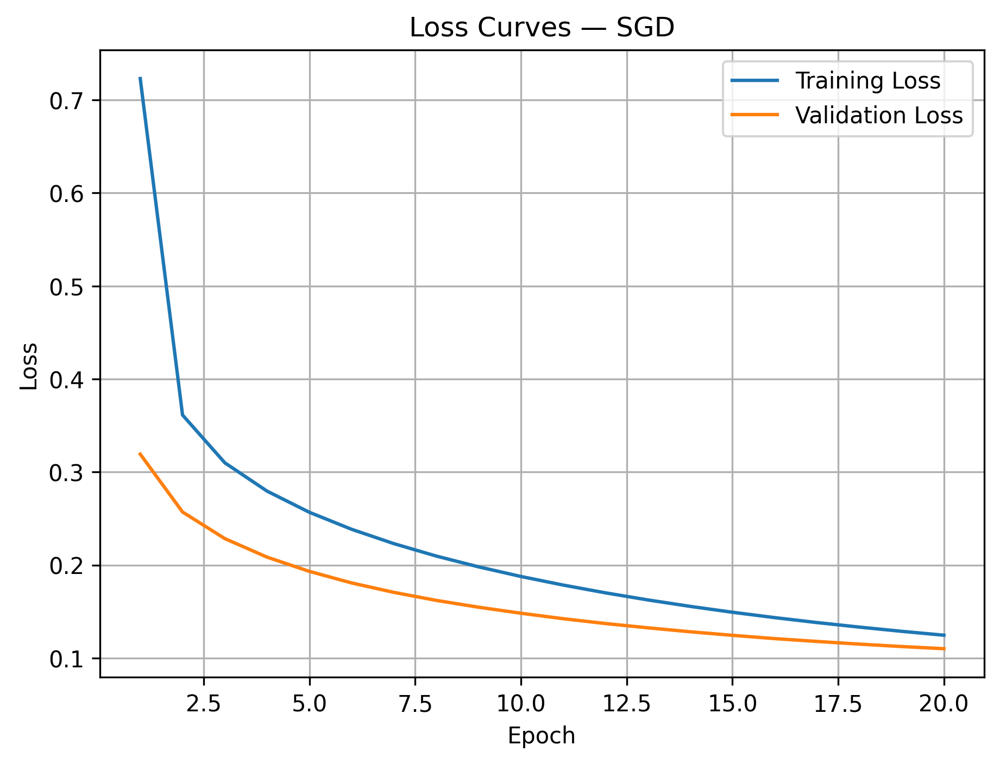
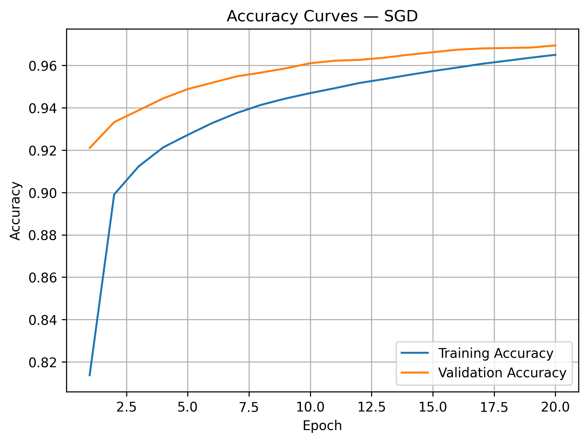
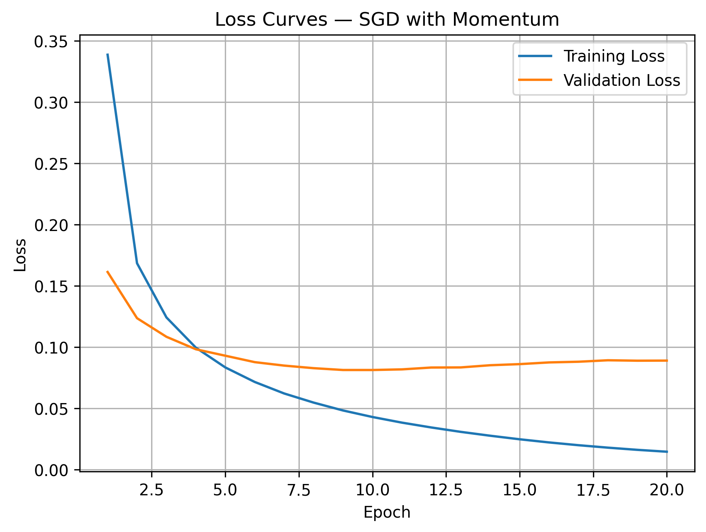
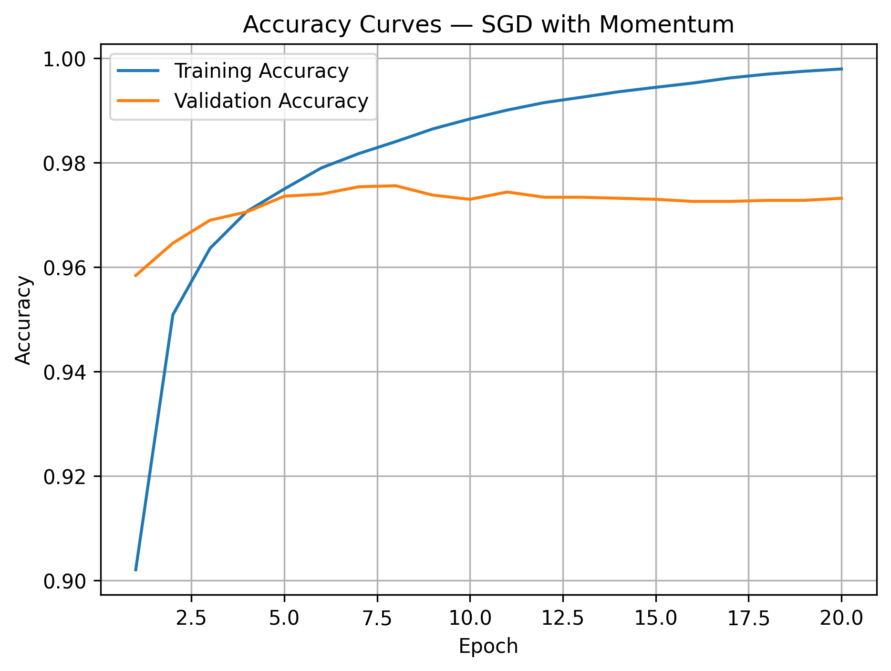
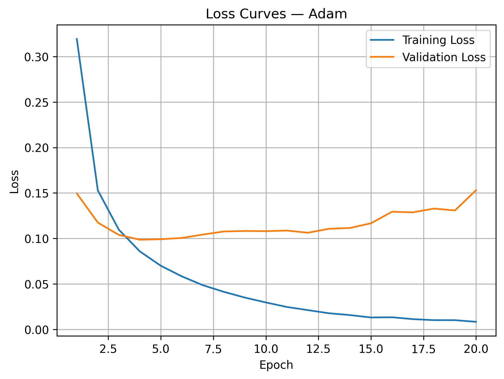
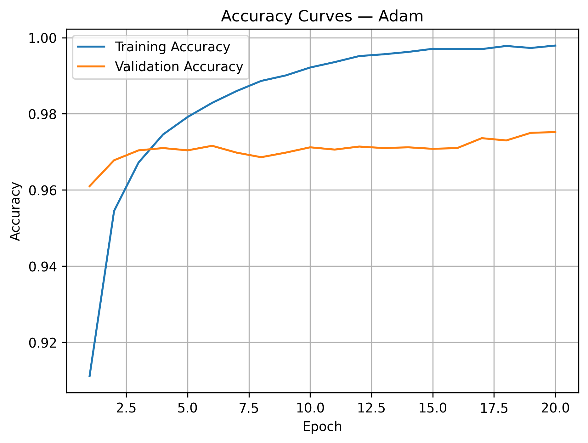
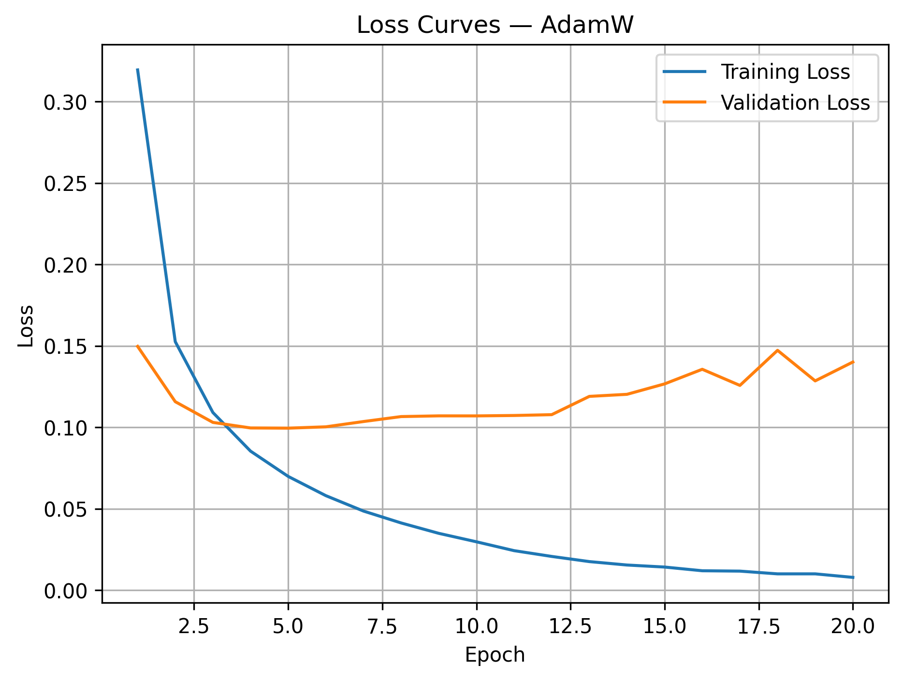
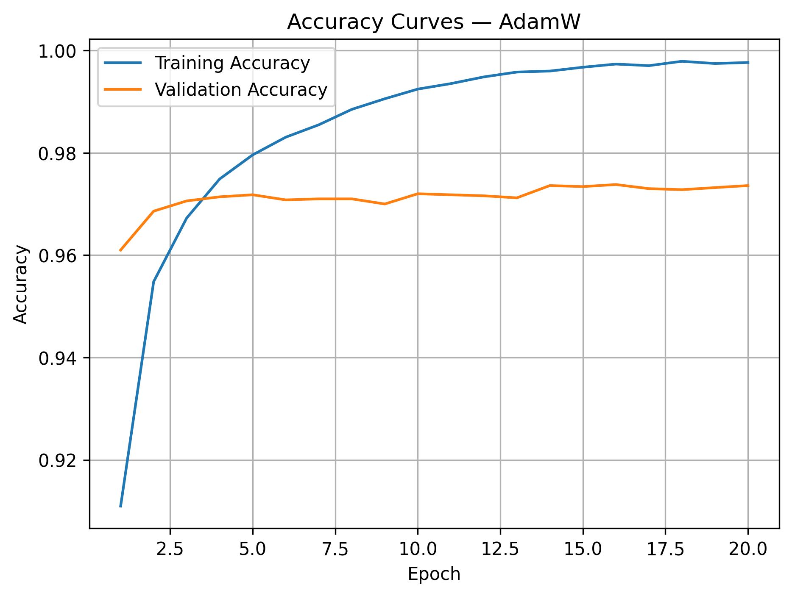

# Task 07 — Optimizer Comparison Challenge

## 1. Objective

The objective of this experiment is to compare four optimizers using the same neural-network architecture:

- SGD
- SGD with Momentum
- Adam
- AdamW

The comparison focuses on:

- Convergence speed.
- Training stability.
- Validation performance.
- Overfitting behavior.
- How each optimizer navigates the loss landscape.

All models used the same dataset, architecture, random seed, batch size, and number of epochs.

---

## 2. Optimizer Configurations

```python
SGD:
keras.optimizers.SGD(
    learning_rate=0.01
)

SGD with Momentum:
keras.optimizers.SGD(
    learning_rate=0.01,
    momentum=0.9
)

Adam:
keras.optimizers.Adam(
    learning_rate=0.001
)

AdamW:
keras.optimizers.AdamW(
    learning_rate=0.001,
    weight_decay=0.0001
)
```

Each model was trained for `20` epochs using a batch size of `32`.

The learning rates were not identical because the optimizers use different update mechanisms. SGD commonly starts with a larger learning rate, while Adam and AdamW commonly use a smaller value because they adapt the effective update size for each parameter.

---

## 3. Results

| Optimizer | Final Train Loss | Final Val Loss | Final Train Acc | Final Val Acc | Best Val Loss | Best Loss Epoch | Convergence Epoch | Final Val-Loss STD |
|---|---:|---:|---:|---:|---:|---:|---:|---:|
| SGD | 0.1245 | 0.1101 | 96.50% | 96.94% | 0.1101 | 20 | 20 | 0.003842 |
| SGD with Momentum | 0.0147 | 0.0891 | 99.80% | 97.44% | 0.0814 | 10 | 9 | 0.000657 |
| Adam | 0.0083 | 0.1530 | 99.79% | 97.14% | 0.0986 | 4 | 4 | 0.009132 |
| AdamW | 0.0091 | 0.1370 | 99.77% | 97.36% | 0.0985 | 4 | 4 | 0.003487 |

Training times were similar:

| Optimizer | Training Time |
|---|---:|
| SGD | 109.03 seconds |
| SGD with Momentum | 96.97 seconds |
| Adam | 102.46 seconds |
| AdamW | 104.68 seconds |

The small time differences may be influenced by the Colab runtime and should not be treated as precise optimizer benchmarks.

> The current experiment code stores the best validation loss and its epoch, but it does not store the best validation accuracy or its epoch. Therefore, those two columns were not included in the results table.

---

## 4. Loss and Accuracy Curves

### SGD





### SGD with Momentum





### Adam





### AdamW





---

## 5. Short Analysis

### SGD — Slow but Steady Convergence

SGD showed the slowest convergence among the four optimizers.

Its training and validation losses decreased continuously throughout all `20` epochs. The best validation loss was reached at epoch `20`, indicating that the model was still improving when training ended.

The final validation accuracy was `96.94%`, which was the lowest among the tested optimizers. However, the curves did not show clear overfitting.

The final validation loss was slightly lower than the training loss:

```text
0.1101 - 0.1245 = -0.0144
```

This can occur because the training loss is averaged across batches while the weights are being updated. Validation loss is calculated after the epoch using the final updated weights.

The results suggest that SGD may have benefited from additional epochs or a learning-rate schedule.

---

### SGD with Momentum — Best Overall Validation Performance

Adding Momentum significantly accelerated SGD.

The optimizer reached the convergence threshold at epoch `9` and achieved its best validation loss of `0.0814` at epoch `10`.

This was the lowest best validation loss among the four optimizers. It also achieved the highest final validation accuracy, `97.44%`.

Momentum preserves useful update directions across batches. This helps the optimizer move faster when gradients repeatedly point in a similar direction and reduces unnecessary side-to-side oscillation.

After approximately epoch `10`, training loss continued decreasing while validation loss gradually increased. This indicates that overfitting began after the model reached its best validation-loss performance.

Its final five-epoch validation-loss standard deviation was only `0.000657`, the lowest of the four experiments. The late validation curve changed very little, although it showed a small upward trend.

---

### Adam — Fast Convergence but Strongest Overfitting

Adam converged very quickly and reached its best validation loss of `0.0986` at epoch `4`.

However, after the early epochs, training loss continued decreasing toward zero while validation loss increased to `0.1530`.

The final loss gap was:

```text
0.1530 - 0.0083 = 0.1447
```

This was the largest final loss gap among the four optimizers and indicates strong overfitting.

Adam also had the highest final five-epoch validation-loss standard deviation, `0.009132`, showing the largest late-stage variation in validation loss.

Adam was highly effective at minimizing training loss, but without EarlyStopping or stronger regularization, it continued fitting training-specific patterns after validation performance had stopped improving.

---

### AdamW — Fast Convergence with Reduced Late Overfitting

AdamW also converged quickly, reaching the convergence threshold and its best validation loss at epoch `4`.

Its best validation loss was `0.0985`, which was nearly identical to Adam's `0.0986`.

AdamW applies weight decay separately from the adaptive gradient update. This is intended to control weight growth more consistently than applying a traditional L2 penalty inside Adam.

The final loss gap was:

```text
0.1370 - 0.0091 = 0.1279
```

AdamW still showed overfitting because its training loss continued decreasing while validation loss increased after the early epochs.

However, under these settings, AdamW produced a lower final validation loss, a higher final validation accuracy, and a lower late-stage validation-loss standard deviation than Adam. This suggests that weight decay reduced late overfitting to some extent, although it did not eliminate it.

---

## 6. Convergence Speed Comparison

According to the convergence metric, the optimizers ranked as follows:

| Rank | Optimizer | Convergence Epoch |
|---:|---|---:|
| 1 | Adam | 4 |
| 1 | AdamW | 4 |
| 3 | SGD with Momentum | 9 |
| 4 | SGD | 20 |

Adam and AdamW converged fastest because they adapted the effective update size separately for each parameter.

SGD with Momentum was slower than the adaptive optimizers but substantially faster than standard SGD.

Standard SGD required the full `20` epochs and was still improving at the end of training.

---

## 7. Stability Comparison

Using the standard deviation of the final five validation-loss values:

| Optimizer | Final Five-Epoch Val-Loss STD |
|---|---:|
| SGD with Momentum | 0.000657 |
| AdamW | 0.003487 |
| SGD | 0.003842 |
| Adam | 0.009132 |

SGD with Momentum produced the least variable validation loss near the end.

Adam produced the largest late-stage variation.

However, this standard deviation should not be interpreted alone. For example, SGD's value is partly influenced by its validation loss still decreasing steadily rather than fluctuating around a fixed value.

---

## 8. How Each Optimizer Navigates the Loss Landscape

### SGD

SGD updates the parameters using the current batch gradient:

```text
Current gradient
→ One update direction
→ Same global learning rate for all parameters
```

It follows the local slope directly and can therefore move slowly through flat regions or oscillate across narrow valleys.

Its simplicity may sometimes help it reach solutions that generalize well, but it often requires careful learning-rate tuning and more epochs.

### SGD with Momentum

Momentum combines the current gradient with a moving accumulation of previous update directions.

```text
Current gradient
+
Previous direction
=
Smoothed update
```

It accelerates movement when gradients repeatedly point in the same direction and reduces side-to-side oscillation.

This allowed it to converge much faster than standard SGD and achieve the best validation performance in this experiment.

### Adam

Adam maintains two moving estimates:

- The average direction of the gradients.
- The average squared magnitude of the gradients.

It then assigns an adaptive update size to each parameter.

Parameters with consistently large or unstable gradients receive relatively smaller updates, while parameters with smaller gradients may receive relatively larger updates.

This allows Adam to move efficiently through loss landscapes containing:

- Different gradient scales.
- Flat regions.
- Noisy gradients.
- Narrow valleys.

### AdamW

AdamW uses Adam's adaptive updates but applies weight decay separately.

```text
Adaptive gradient update
+
Independent weight decay
```

This separation is intended to make regularization more predictable. However, the weight-decay coefficient must still be tuned appropriately.

In this experiment, AdamW reduced late overfitting compared with Adam, but it did not prevent overfitting completely.

---

## 9. Why Adam Often Outperforms Classical Optimizers

Adam often performs well because it combines two useful ideas:

1. **Momentum-like gradient smoothing**

   Adam tracks a moving average of previous gradients, reducing the effect of noisy batch updates.

2. **Adaptive per-parameter learning rates**

   Each weight receives an update size based on its own gradient history rather than using the same effective step size for every parameter.

This allows Adam to:

- Converge quickly.
- Require less manual learning-rate tuning.
- Handle differently scaled gradients.
- Perform well with noisy or sparse gradients.

However, Adam does not always produce the best generalization.

In this experiment, Adam converged faster than SGD with Momentum, but SGD with Momentum achieved a lower best validation loss, a lower final validation loss, and a higher final validation accuracy.

Therefore, Adam's main advantage was optimization speed, while SGD with Momentum achieved the best validation performance.

---

## 10. Key Takeaway

Standard SGD converged slowly but continued improving throughout all `20` epochs.

SGD with Momentum provided the best overall validation performance. It achieved the lowest best validation loss of `0.0814`, the lowest final validation loss of `0.0891`, and the highest final validation accuracy of `97.44%`.

Adam and AdamW converged the fastest, reaching their best validation-loss region by epoch `4`.

Adam showed the strongest overfitting and the largest late-stage validation-loss variation.

AdamW also overfit, but it performed better than Adam near the end of training under the selected weight-decay setting.

The experiment demonstrates that faster optimization does not always produce better generalization. In this case, SGD with Momentum provided the best balance between convergence speed, stability, and validation performance.
