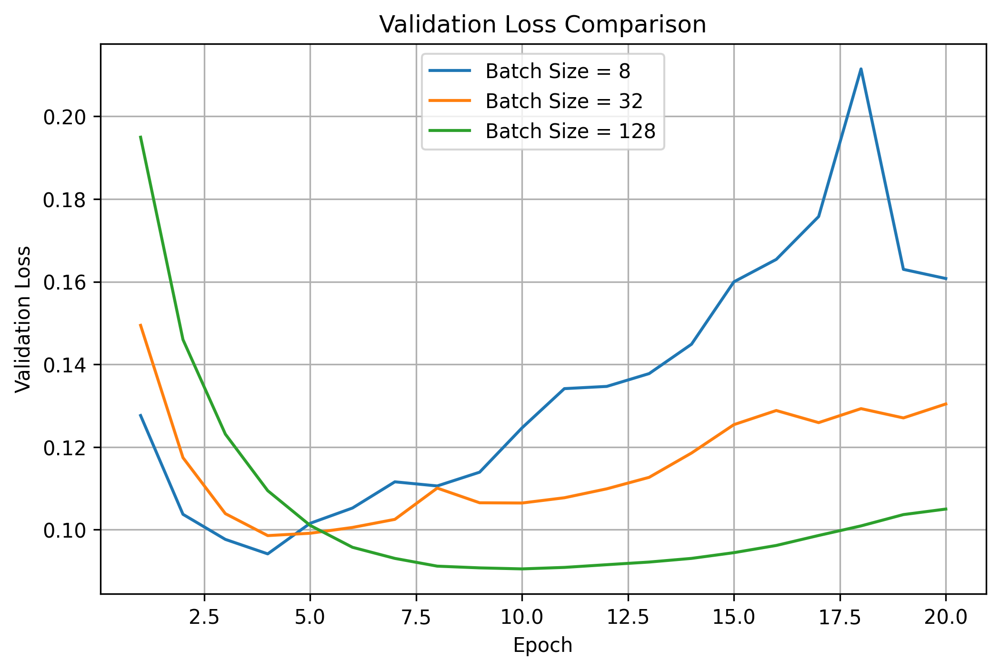
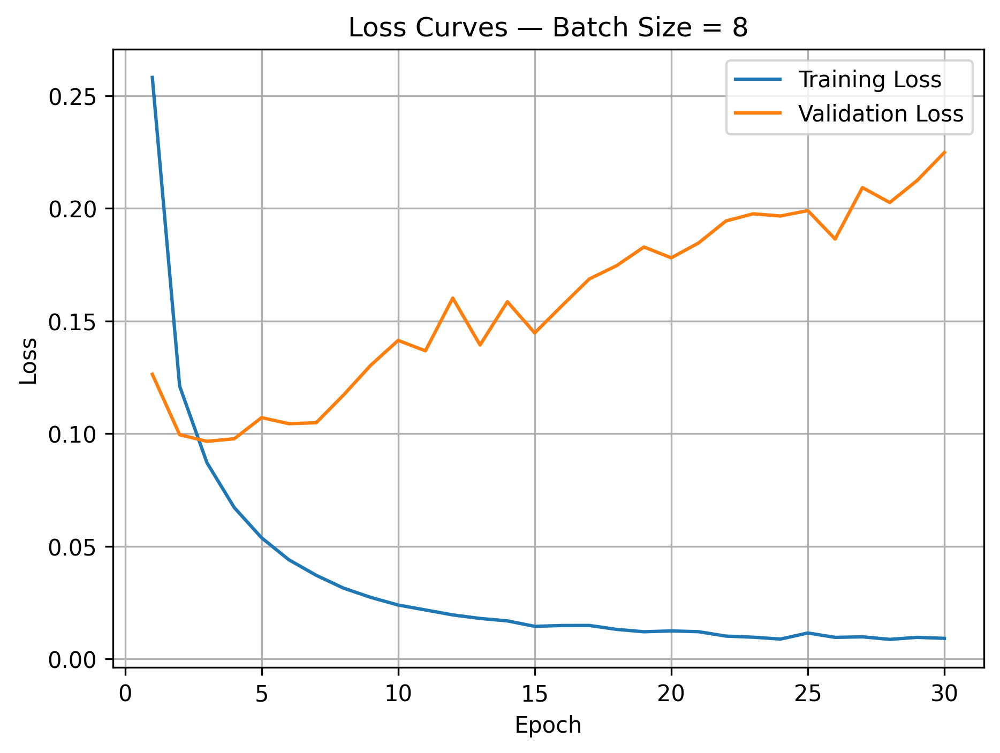
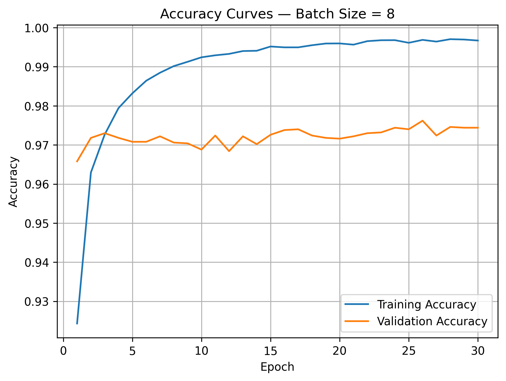
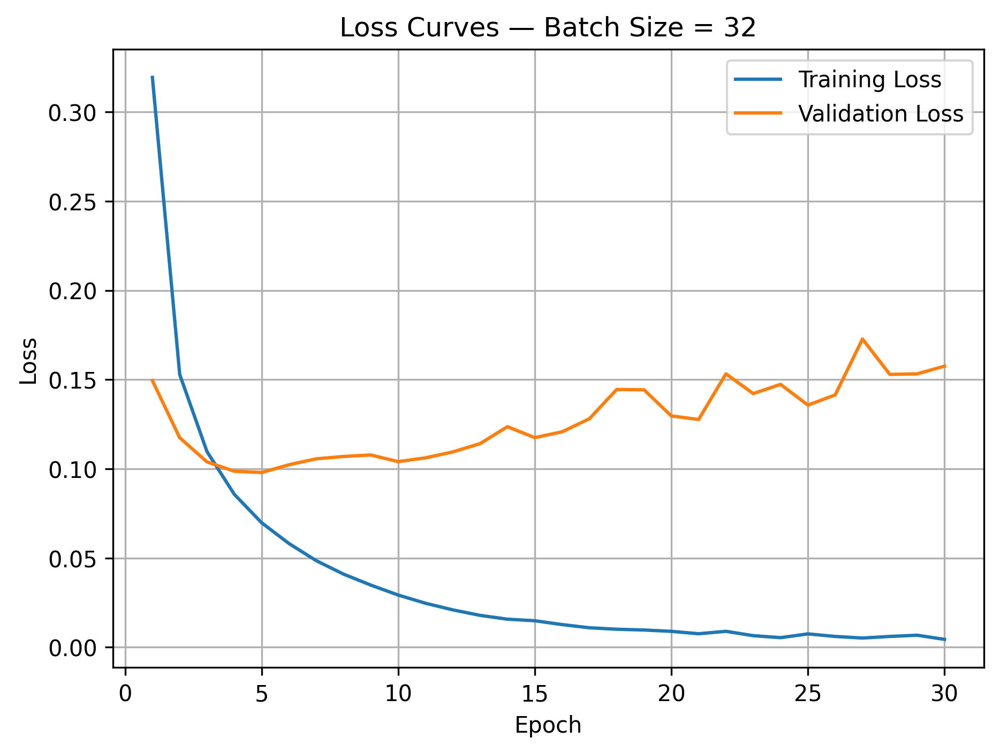
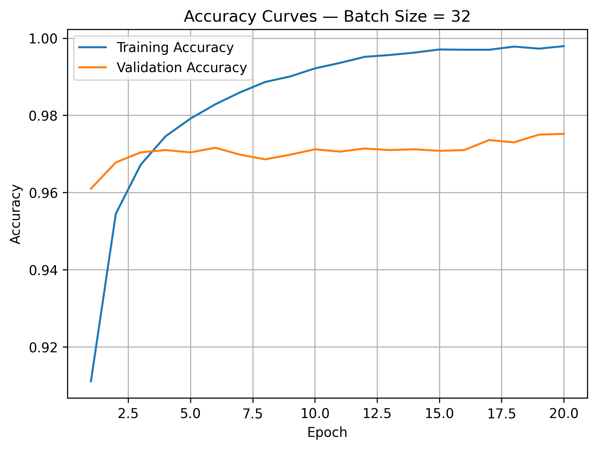
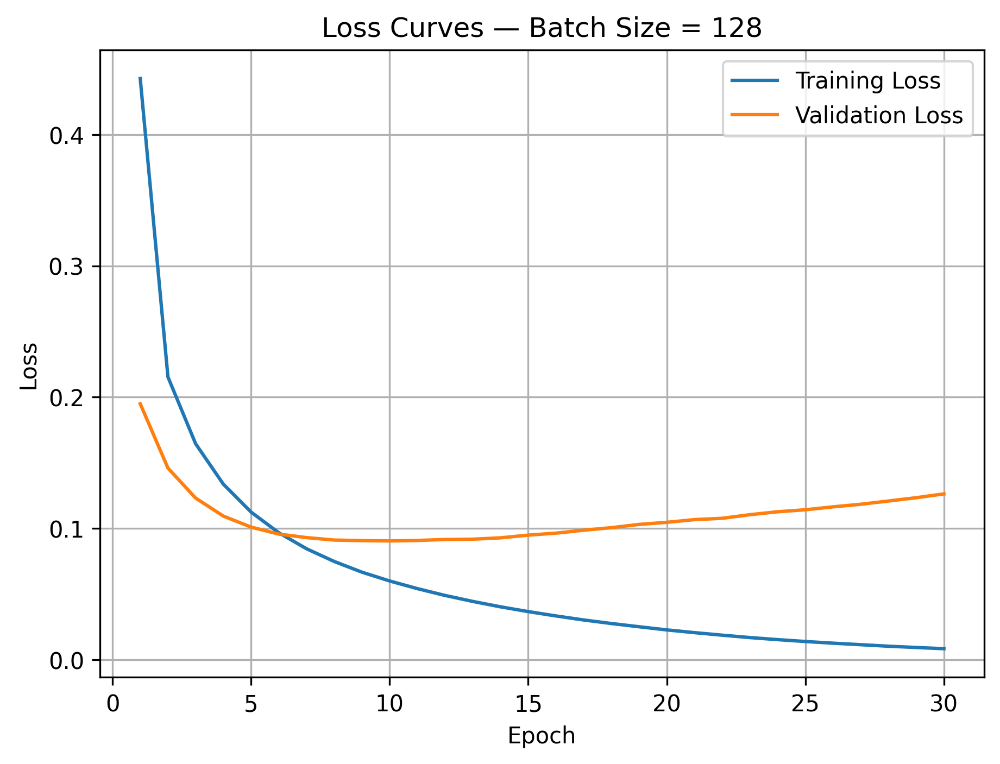
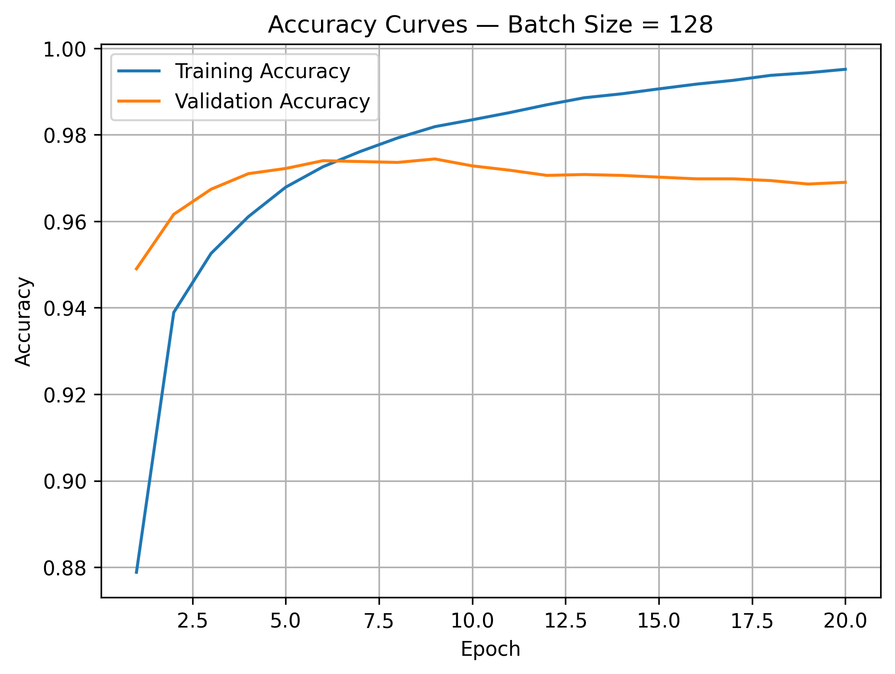

# Task 08 — Batch Size & Gradient Noise Experiment

## 1. Objective

The objective of this experiment is to study how changing the batch size affects:

- Gradient noise.
- Training speed.
- Generalization.
- Overfitting.
- The smoothness of the loss curves.

Three independent models were trained using:

- Batch Size = `8`
- Batch Size = `32`
- Batch Size = `128`

All other settings, including the model architecture, optimizer, learning rate, dataset, random seed, and number of epochs, were kept constant.

---

## 2.  Code Used

```python
# Create a directory for Task 8 results.

def create_batch_size_model(seed=42):

    # Ensure reproducible initial weights.
    keras.utils.set_random_seed(seed)

    model = keras.Sequential([
        keras.layers.Input(shape=(28, 28)),

        # Convert each 28×28 image into 784 values.
        keras.layers.Flatten(),

        # Hidden layer.
        keras.layers.Dense(64, activation="relu"),

        # Output layer for digits 0–9.
        keras.layers.Dense(10, activation="softmax")
    ])

    model.compile(
        optimizer="adam",
        loss="sparse_categorical_crossentropy",
        metrics=["accuracy"]
    )
    return model


def plot_curves(history, label, save_dir, file_prefix, metric):
    # Plot and save training vs validation curves for a given metric.
    epoch_range = range(1, len(history.history[metric]) + 1)

    plt.figure(figsize=(7, 5))
    plt.plot(epoch_range, history.history[metric],          label=f"Training {metric.capitalize()}")
    plt.plot(epoch_range, history.history[f"val_{metric}"], label=f"Validation {metric.capitalize()}")
    plt.title(f"{metric.capitalize()} Curves — {label}")
    plt.xlabel("Epoch")
    plt.ylabel(metric.capitalize())
    plt.legend()
    plt.grid()

    output_path = save_dir / f"{file_prefix}_{metric}.png"

    # Save the figure before displaying it.
    plt.savefig(output_path, dpi=300, bbox_inches="tight")
    plt.show()
    plt.close()
    print(f"Saved: {output_path}")


# Train all three batch-size configurations.
batch_sizes      = [8, 32, 128]
number_of_epochs = 30
batch_histories  = {}
batch_results    = {}

for batch_size in batch_sizes:

    label       = f"Batch Size = {batch_size}"
    file_prefix = f"batch_{batch_size}"

    # Create a fresh model for this experiment.
    model = create_batch_size_model(seed=42)

    # Calculate the number of weight updates per epoch.
    steps_per_epoch = math.ceil(len(x_train) / batch_size)

    # Measure the total training time.
    start_time = time.time()

    history = model.fit(
        x_train, y_train,
        epochs=number_of_epochs,
        batch_size=batch_size,
        validation_data=(x_val, y_val),
        shuffle=True,
        verbose=1
    )

    training_time = time.time() - start_time

    # Store the history for the comparison plot.
    batch_histories[batch_size] = history

    # Create and save the loss and accuracy plots.
    plot_curves(history, label, task8_results_dir, file_prefix, "loss")
    plot_curves(history, label, task8_results_dir, file_prefix, "accuracy")

    # Find the lowest validation loss and its epoch.
    best_val_loss       = np.min(history.history["val_loss"])
    best_val_loss_epoch = np.argmin(history.history["val_loss"]) + 1

    # Measure validation-loss variation over the final five epochs.
    final_five_val_loss_std = np.std(history.history["val_loss"][-5:])

    # Store the main results needed for comparison.
    batch_results[batch_size] = {
        "final_train_loss":       history.history["loss"][-1],
        "final_val_loss":         history.history["val_loss"][-1],
        "final_val_accuracy":     history.history["val_accuracy"][-1],
        "best_val_loss":          best_val_loss,
        "best_val_loss_epoch":    best_val_loss_epoch,
        "steps_per_epoch":        steps_per_epoch,
        "final_five_val_loss_std":final_five_val_loss_std,
        "training_time":          training_time
    }


# Plot validation-loss comparison across all batch sizes.
plt.figure(figsize=(8, 5))
for batch_size, history in batch_histories.items():
    epoch_range = range(1, len(history.history["val_loss"]) + 1)
    plt.plot(epoch_range, history.history["val_loss"], label=f"Batch Size = {batch_size}")

plt.title("Validation Loss Comparison")
plt.xlabel("Epoch")
plt.ylabel("Validation Loss")
plt.legend()
plt.grid()

comparison_path = task8_results_dir / "batch_size_validation_loss_comparison.png"
plt.savefig(comparison_path, dpi=300, bbox_inches="tight")
plt.show()
plt.close()
print(f"Saved: {comparison_path}")


# Print and save all results.
results_file = task8_results_dir / "task08_batch_size_results.txt"

with open(results_file, "w", encoding="utf-8") as f:
    f.write("Task 08 — Batch Size & Gradient Noise Experiment\n")
    f.write("=" * 55 + "\n")

    for batch_size, r in batch_results.items():
        line = (
            f"\nBatch Size = {batch_size}\n"
            f"Final Training Loss:               {r['final_train_loss']:.4f}\n"
            f"Final Validation Loss:             {r['final_val_loss']:.4f}\n"
            f"Final Validation Accuracy:         {r['final_val_accuracy']:.4f}\n"
            f"Best Validation Loss:              {r['best_val_loss']:.4f}\n"
            f"Best Validation Loss Epoch:        {r['best_val_loss_epoch']}\n"
            f"Steps Per Epoch:                   {r['steps_per_epoch']}\n"
            f"Final 5-Epoch Validation Loss STD: {r['final_five_val_loss_std']:.6f}\n"
            f"Training Time:                     {r['training_time']:.2f} seconds\n"
        )
        print(line)
        f.write(line)

print(f"Results saved to: {results_file}")
```
---

## 3. Results

| Batch Size | Final Train Loss | Final Val Loss | Final Val Accuracy | Best Val Loss | Best Epoch | Steps per Epoch | Final 5-Epoch Val-Loss STD | Training Time |
|-----------:|-----------------:|---------------:|-------------------:|--------------:|-----------:|----------------:|---------------------------:|--------------:|
| `8`   | 0.0092 | 0.2248 | 97.44% | 0.0966 | 3  | 6875 | 0.012605 | 517.55 s |
| `32`  | 0.0044 | 0.1575 | 97.48% | 0.0979 | 5  | 1719 | 0.010120 | 185.63 s |
| `128` | 0.0085 | 0.1263 | 97.18% | 0.0905 | 10 | 430  | 0.003504 | 65.68 s |

### Validation Loss Comparison



---

## 4. Loss and Accuracy Curves

### Batch Size = 8

<table>
  <tr>
    <th>Loss Curves</th>
    <th>Accuracy Curves</th>
  </tr>
  <tr>
    <td>
      
    </td>
    <td>
      
    </td>
  </tr>
</table>

---

### Batch Size = 32

<table>
  <tr>
    <th>Loss Curves</th>
    <th>Accuracy Curves</th>
  </tr>
  <tr>
    <td>
      
    </td>
    <td>
      
    </td>
  </tr>
</table>

---

### Batch Size = 128

<table>
  <tr>
    <th>Loss Curves</th>
    <th>Accuracy Curves</th>
  </tr>
  <tr>
    <td>
      
    </td>
    <td>
      
    </td>
  </tr>
</table>

---

## 5. Short Analysis

### Batch Size = 8 — Many Updates and Early Overfitting

Batch Size `8` performed `6875` parameter updates per epoch, which was the largest number among the three configurations.

It reached its best validation loss of `0.0966` at epoch `3`. After that point, the training loss continued decreasing until it reached `0.0092`, while the validation loss increased substantially to `0.2248`.

The validation-loss curve became increasingly irregular during the later epochs. Its final five-epoch validation-loss standard deviation was `0.012605`, the highest among the three configurations.

**This indicates that the small batch produced less stable validation behavior and began overfitting early.**

It also required the longest training time, `517.55` seconds, because the small batch caused a very large number of weight updates.

---

### Batch Size = 32 — Balanced and Stable Behavior

Batch Size `32` performed `1719` updates per epoch.

It reached its best validation loss of `0.0979` at epoch `5`. Its training loss continued decreasing after that point, while validation loss gradually increased to `0.1575`, indicating overfitting.

However, its validation-loss curve was considerably more stable than Batch Size `8`.

The final five-epoch validation-loss standard deviation was `0.010120`, showing more late-stage variation than Batch Size `128` but less than Batch Size `8`.

This configuration provided a practical balance between:

- Training speed.
- Gradient stability.
- Validation accuracy.
- Computational cost.

Its total training time was `185.63` seconds, substantially lower than Batch Size `8`.

---

### Batch Size = 128 — Fastest Training and Lowest Best Validation Loss

Batch Size `128` required only `430` updates per epoch.

It completed training in `65.68` seconds, making it the fastest configuration by a large margin.

This model reached the lowest best validation loss among all three experiments:

```text
Best Validation Loss = 0.0905
Best Epoch = 10
```

It also produced the smallest final train–validation loss gap:

```text
0.1263 - 0.0085 = 0.1178
```

However, its final validation accuracy was `97.18%`, which was slightly lower than the validation accuracies achieved with Batch Sizes `8` and `32`.

Therefore, the larger batch achieved better validation loss and faster computation, but slightly lower classification accuracy.

---

## 6. Effect of Batch Size

### Gradient Noise

The gradient is estimated from the samples inside each batch.

Small batches use fewer samples, so the gradient direction can vary more from one update to another:

```text
Small batch → Noisier gradient estimate
Large batch → More stable gradient estimate
```

In this experiment, Batch Size `8` showed the most irregular validation-loss behavior, while Batch Size `128` showed the smoothest curve.

---

### Training Speed

Larger batches require fewer updates per epoch:

```text
Batch Size = 8   → 6875 steps per epoch
Batch Size = 32  → 1719 steps per epoch
Batch Size = 128 → 430 steps per epoch
```

This explains why Batch Size `128` trained much faster than Batch Size `8`.

---

### Generalization and Overfitting
Batch size affects how much gradient noise appears during training.

A small batch uses fewer samples to estimate the gradient, so the update direction is noisier. This noise can sometimes help the optimizer explore different regions of the loss landscape instead of following one very precise path. In this sense, small-batch noise may act as a form of implicit regularization.

A large batch produces a more stable gradient estimate. This can make training smoother and faster, but it may reduce exploration. In some cases, this can lead the model toward sharper minima that fit the training data well but generalize less effectively to unseen data.

However, this behavior is not guaranteed.

In this experiment, the results did **not** clearly show that larger batches generalize worse. Batch Size `128` achieved the lowest best validation loss and the lowest final validation loss, while Batch Size `32` achieved the highest final validation accuracy.

```text
Batch Size 128 → Best Val Loss = 0.0905, Final Val Loss = 0.1263
Batch Size 32  → Final Val Accuracy = 97.48%
```

Therefore, the generalization result depends on the evaluation metric:

- If we focus on Validation Loss, Batch Size 128 performed best.
- If we focus on Validation Accuracy, Batch Size 32 performed best.
- Batch Size 8 showed early overfitting and the most unstable validation-loss behavior.

So, larger batches may sometimes generalize worse in theory, but this experiment showed a more nuanced tradeoff rather than a simple rule.

## 7. Key Takeaway

Changing batch size affected the number of weight updates, training time, validation-loss smoothness, and overfitting behavior.

Batch Size `8` introduced more update noise, took the longest time, and showed early overfitting.

Batch Size `32` achieved the highest final validation accuracy.

Batch Size `128` trained fastest, produced the smoothest validation-loss trend, and achieved the lowest best validation loss.

The best batch size depends on the evaluation goal: validation loss, validation accuracy, training speed, or stability.
