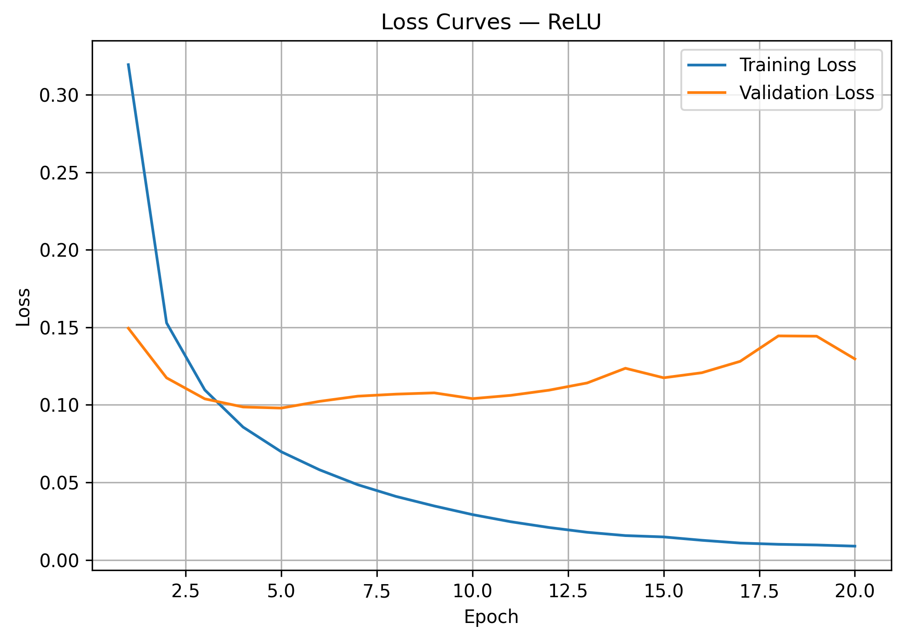
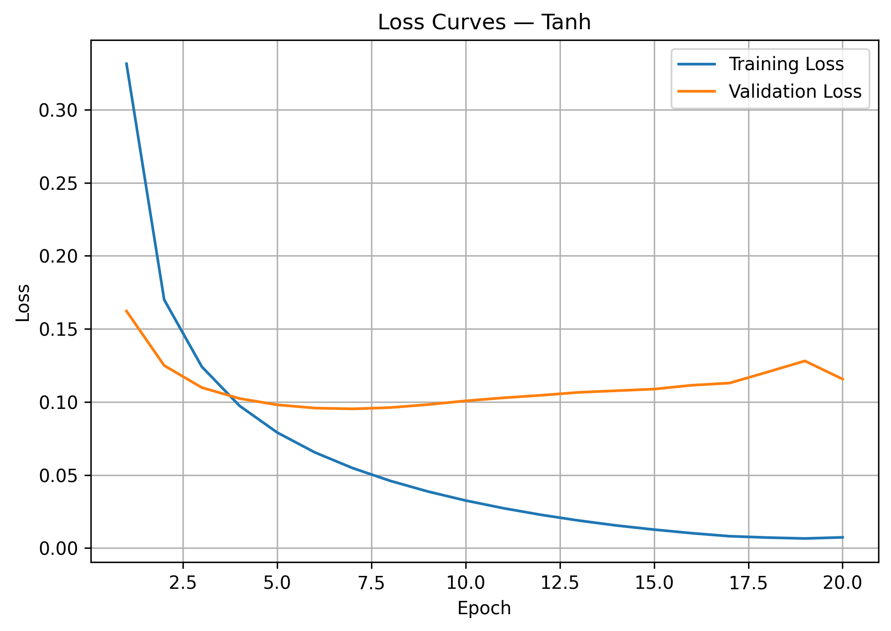
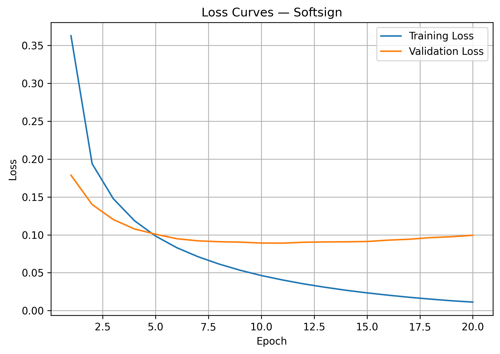
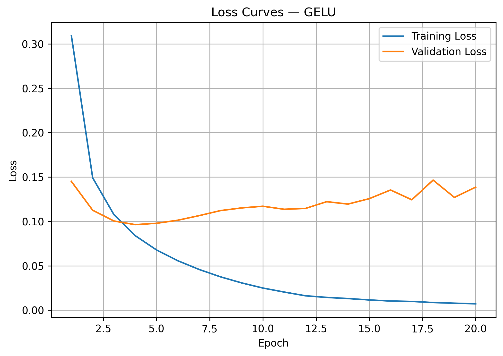
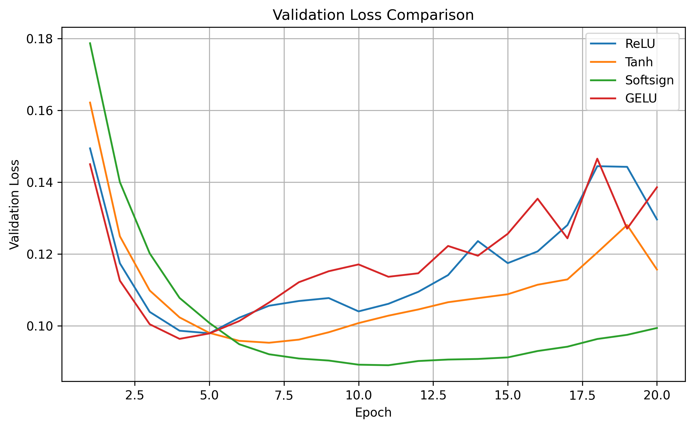
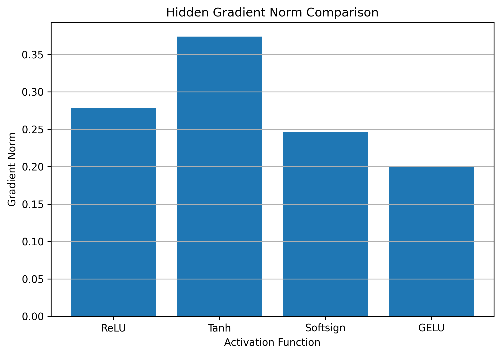

# Task 09 — Activation Function Swap

## 1. Objective

The objective of this experiment is to compare different activation functions in the hidden layer of the same neural network model.

The original model used `ReLU`. In this task, the activation function was replaced with:

- `Tanh`
- `Softsign`
- `GELU`

The comparison focuses on:

- How each activation affects gradient flow.
- Which activations may suffer from vanishing gradients.
- Why GELU performs well in Transformer architectures.
- Why ReLU remains preferred in many MLP and CNN models.

All models used the same dataset, architecture, optimizer, learning rate, batch size, number of epochs, and random seed.

---

## 2. Code Used

```python
from pathlib import Path

import matplotlib.pyplot as plt
import numpy as np
import tensorflow as tf
from tensorflow import keras


# Create the results directory.
task9_results_dir = Path("results/activation_tests/task09_activations")
task9_results_dir.mkdir(parents=True, exist_ok=True)


# Define the activation functions to compare.
activation_functions = {
    "ReLU":     keras.activations.relu,
    "Tanh":     keras.activations.tanh,
    "Softsign": keras.activations.softsign,
    "GELU":     keras.activations.gelu
}


def create_activation_model(activation_function, seed=42):

    # Clear the previous model from memory.
    keras.backend.clear_session()

    # Ensure that every model starts with the same initial weights.
    keras.utils.set_random_seed(seed)

    model = keras.Sequential([
        keras.layers.Input(shape=(28, 28)),

        # Convert the image into 784 pixel values.
        keras.layers.Flatten(),

        # The activation function changes in each experiment.
        keras.layers.Dense(
            64,
            activation=activation_function,
            name="hidden_dense"
        ),

        # Output probabilities for digits 0–9.
        keras.layers.Dense(10, activation="softmax")
    ])

    model.compile(
        optimizer=keras.optimizers.Adam(learning_rate=0.001),
        loss="sparse_categorical_crossentropy",
        metrics=["accuracy"]
    )

    return model


def calculate_gradient_norm(model, x_sample, y_sample):
    # Measure gradient flow through the hidden layer.

    loss_fn = keras.losses.SparseCategoricalCrossentropy()

    with tf.GradientTape() as tape:
        predictions = model(x_sample, training=True)
        loss = loss_fn(y_sample, predictions)

    hidden_weights = model.get_layer("hidden_dense").kernel
    gradients = tape.gradient(loss, hidden_weights)

    return tf.norm(gradients).numpy()


def plot_loss_curves(history, activation_name):
    # Plot and save training vs validation loss curves.

    epoch_range = range(1, len(history.history["loss"]) + 1)

    plt.figure(figsize=(7, 5))
    plt.plot(epoch_range, history.history["loss"],     label="Training Loss")
    plt.plot(epoch_range, history.history["val_loss"], label="Validation Loss")

    plt.title(f"Loss Curves — {activation_name}")
    plt.xlabel("Epoch")
    plt.ylabel("Loss")
    plt.legend()
    plt.grid()
    plt.tight_layout()

    output_path = task9_results_dir / f"{activation_name.lower()}_loss.png"

    # Save the figure before displaying it.
    plt.savefig(output_path, dpi=300, bbox_inches="tight")
    plt.show()
    plt.close()

    print(f"Saved: {output_path}")


# Train all activation configurations.
number_of_epochs     = 20
batch_size           = 32
activation_histories = {}
activation_results   = {}

# Use the same validation sample to compare gradient flow.
x_gradient_sample = tf.convert_to_tensor(x_val[:256], dtype=tf.float32)
y_gradient_sample = tf.convert_to_tensor(y_val[:256])


for activation_name, activation_function in activation_functions.items():

    # Create a fresh model for this experiment.
    model = create_activation_model(
        activation_function=activation_function,
        seed=42
    )

    history = model.fit(
        x_train, y_train,
        epochs=number_of_epochs,
        batch_size=batch_size,
        validation_data=(x_val, y_val),
        shuffle=True,
        verbose=1
    )

    # Store the training history.
    activation_histories[activation_name] = history

    # Save only the needed loss plot.
    plot_loss_curves(history, activation_name)

    # Calculate gradient norm after training.
    gradient_norm = calculate_gradient_norm(
        model,
        x_gradient_sample,
        y_gradient_sample
    )

    # Store all calculated results.
    activation_results[activation_name] = {
        "final_train_loss":     history.history["loss"][-1],
        "final_val_loss":       history.history["val_loss"][-1],
        "final_train_accuracy": history.history["accuracy"][-1],
        "final_val_accuracy":   history.history["val_accuracy"][-1],
        "best_val_loss":        np.min(history.history["val_loss"]),
        "best_val_loss_epoch":  np.argmin(history.history["val_loss"]) + 1,
        "final_loss_gap":       history.history["val_loss"][-1] - history.history["loss"][-1],
        "gradient_norm":        gradient_norm
    }


# Plot validation-loss comparison across all activations.
plt.figure(figsize=(8, 5))

for activation_name, history in activation_histories.items():
    epoch_range = range(1, len(history.history["val_loss"]) + 1)
    plt.plot(epoch_range, history.history["val_loss"], label=activation_name)

plt.title("Validation Loss Comparison")
plt.xlabel("Epoch")
plt.ylabel("Validation Loss")
plt.legend()
plt.grid()
plt.tight_layout()

comparison_path = task9_results_dir / "activation_validation_loss_comparison.png"

plt.savefig(comparison_path, dpi=300, bbox_inches="tight")
plt.show()
plt.close()

print(f"Saved: {comparison_path}")


# Plot gradient norm comparison.
plt.figure(figsize=(7, 5))

plt.bar(
    activation_results.keys(),
    [r["gradient_norm"] for r in activation_results.values()]
)

plt.title("Hidden Gradient Norm Comparison")
plt.xlabel("Activation Function")
plt.ylabel("Gradient Norm")
plt.grid(axis="y")
plt.tight_layout()

gradient_path = task9_results_dir / "activation_gradient_norm_comparison.png"

plt.savefig(gradient_path, dpi=300, bbox_inches="tight")
plt.show()
plt.close()

print(f"Saved: {gradient_path}")


# Print and save all results.
results_file = task9_results_dir / "task09_activation_results.txt"

with open(results_file, "w", encoding="utf-8") as f:
    f.write("Task 09 — Activation Function Comparison\n")
    f.write("=" * 50 + "\n")

    for activation_name, r in activation_results.items():
        line = (
            f"\nActivation = {activation_name}\n"
            f"Final Training Loss:       {r['final_train_loss']:.4f}\n"
            f"Final Validation Loss:     {r['final_val_loss']:.4f}\n"
            f"Final Training Accuracy:   {r['final_train_accuracy']:.4f}\n"
            f"Final Validation Accuracy: {r['final_val_accuracy']:.4f}\n"
            f"Best Validation Loss:      {r['best_val_loss']:.4f}\n"
            f"Best Validation Loss Epoch:{r['best_val_loss_epoch']}\n"
            f"Final Loss Gap:            {r['final_loss_gap']:.4f}\n"
            f"Hidden Gradient Norm:      {r['gradient_norm']:.6f}\n"
        )

        print(line)
        f.write(line)

print(f"Results saved to: {results_file}")
```

---

## 3. Results

| Activation | Final Train Loss | Final Val Loss | Final Train Acc | Final Val Acc | Best Val Loss | Best Epoch | Final Loss Gap | Hidden Gradient Norm |
|---|---:|---:|---:|---:|---:|---:|---:|---:|
| ReLU | 0.0089 | 0.1296 | 99.73% | 97.36% | 0.0979 | 5 | 0.1207 | 0.277891 |
| Tanh | 0.0074 | 0.1157 | 99.89% | 97.48% | 0.0953 | 7 | 0.1083 | 0.373865 |
| Softsign | 0.0112 | 0.0994 | 99.88% | 97.46% | 0.0890 | 11 | 0.0882 | 0.246544 |
| GELU | 0.0072 | 0.1386 | 99.81% | 97.54% | 0.0964 | 4 | 0.1314 | 0.200162 |

---

## 4. Loss Curves

<table>
  <tr>
    <th>ReLU</th>
    <th>Tanh</th>
  </tr>
  <tr>
    <td>
      
    </td>
    <td>
      
    </td>
  </tr>
</table>

<table>
  <tr>
    <th>Softsign</th>
    <th>GELU</th>
  </tr>
  <tr>
    <td>
      
    </td>
    <td>
      
    </td>
  </tr>
</table>

---

## 5. Validation Loss Comparison



---

## 6. Hidden Gradient Norm Comparison



---

## 7. Short Analysis

### ReLU

ReLU is simple and efficient.

It allows strong gradient flow for positive inputs because its derivative is `1` when the input is greater than zero. This helps reduce the vanishing-gradient problem compared with saturating activations such as Tanh and Softsign.

In this experiment, ReLU reached its best validation loss at Epoch `5`:

```text
Best Validation Loss = 0.0979
Final Validation Loss = 0.1296
Hidden Gradient Norm = 0.277891
```

After the best epoch, training loss continued decreasing while validation loss increased. This indicates overfitting.

ReLU remains preferred in many MLP and CNN models because it is computationally cheap, easy to optimize, and works well in deep networks.

However, ReLU can suffer from the dying ReLU problem, where some neurons output zero for many inputs and stop learning effectively.

---

### Tanh

Tanh maps values into the range `[-1, 1]`.

This can be useful because the output is zero-centered, but Tanh can saturate when the input becomes too large or too small. In saturated regions, the gradient becomes very small.

This means Tanh has a higher risk of vanishing gradients.

In this experiment, Tanh achieved:

```text
Best Validation Loss = 0.0953
Final Validation Loss = 0.1157
Hidden Gradient Norm = 0.373865
```

Tanh had the highest hidden gradient norm in this run, which means the measured gradient flow after training was strong.

However, this does not remove the theoretical risk of vanishing gradients, because Tanh can still saturate for large positive or negative inputs.

---

### Softsign

Softsign is similar to Tanh because it also compresses large values into a limited range.

However, Softsign saturates more gradually than Tanh. This means its gradients may decrease more slowly, which can sometimes help gradient flow compared with Tanh.

In this experiment, Softsign achieved the best validation performance:

```text
Best Validation Loss = 0.0890
Final Validation Loss = 0.0994
Final Loss Gap = 0.0882
Hidden Gradient Norm = 0.246544
```

Softsign had the lowest final validation loss and the smallest final loss gap among the four activations.

This suggests that Softsign provided better generalization in this specific experiment.

However, Softsign can still suffer from vanishing gradients when inputs become very large, because its derivative also becomes small in saturated regions.

---

### GELU

GELU is a smooth activation function. Unlike ReLU, it does not use a hard cutoff at zero. Instead, it smoothly weights inputs based on their value.

In this experiment, GELU reached its best validation loss very early at Epoch `4`:

```text
Best Validation Loss = 0.0964
Final Validation Loss = 0.1386
Final Validation Accuracy = 97.54%
Hidden Gradient Norm = 0.200162
```

GELU achieved the highest final validation accuracy, but it also had the largest final loss gap:

```text
Final Loss Gap = 0.1314
```

This indicates stronger overfitting compared with the other activations.

GELU performed well early, but validation loss increased after the best epoch.

---

## 8. Gradient Flow and Vanishing Gradients

| Activation | Gradient Behavior | Vanishing Gradient Risk |
|---|---|---|
| ReLU | Strong gradient for positive inputs, zero for negative inputs | Lower risk, but may suffer from dying ReLU |
| Tanh | Smooth but saturates near `-1` and `1` | High risk |
| Softsign | Smooth and saturates more gradually than Tanh | Medium risk |
| GELU | Smooth gating with non-linear input weighting | Lower than Tanh, but depends on architecture and input distribution |

Tanh and Softsign are more likely to suffer from vanishing gradients because both can enter saturated regions where the derivative becomes very small.

ReLU reduces this issue for positive inputs, which makes it easier to train deeper MLP and CNN models.

GELU also supports smoother gradient flow, but in this experiment it still overfit after the early epochs.

---

## 9. Why GELU Performs Well in Transformer Architectures

GELU is commonly used in Transformer architectures because it provides smooth, probabilistic-like gating.

Instead of simply removing all negative values like ReLU, GELU allows small negative values to pass in a smooth way.

This is useful in Transformer feed-forward layers because Transformers usually contain:

- Very deep architectures.
- Layer Normalization.
- Residual connections.
- Large hidden dimensions.
- Attention-based representations.

In these settings, smoother activations can improve optimization and representation learning.

However, strong performance in Transformers does not mean GELU will always be the best choice for a small MLP on MNIST.

In this experiment, GELU achieved high validation accuracy, but it did not achieve the best validation loss.

---

## 10. Why ReLU Remains Preferred in Many MLP and CNN Models

ReLU remains widely used because it is simple, fast, and effective.

It is computationally cheaper than Tanh, Softsign, and GELU.

It also avoids saturation for positive inputs, which helps gradients flow better during backpropagation.

For many MLP and CNN models, ReLU provides a strong balance between:

- Training speed.
- Stable optimization.
- Good gradient flow.
- Low computational cost.

Although GELU can perform very well in modern architectures such as Transformers, ReLU is still a strong default choice for many traditional neural-network models.

---

## 11. Key Takeaway

Softsign achieved the best validation loss in this experiment:

```text
Best Validation Loss = 0.0890
Final Validation Loss = 0.0994
```

GELU achieved the highest final validation accuracy:

```text
Final Validation Accuracy = 97.54%
```

Tanh had the highest measured hidden gradient norm:

```text
Hidden Gradient Norm = 0.373865
```

ReLU remained a strong and efficient baseline, but it showed overfitting after its best epoch.

Overall, the results show that the best activation function depends on the evaluation metric.

For this experiment:

- Best validation loss: `Softsign`
- Highest final validation accuracy: `GELU`
- Strongest measured gradient norm: `Tanh`
- Best simple baseline: `ReLU`
